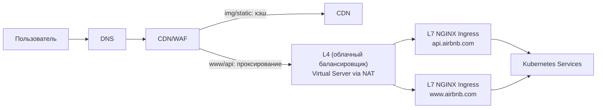
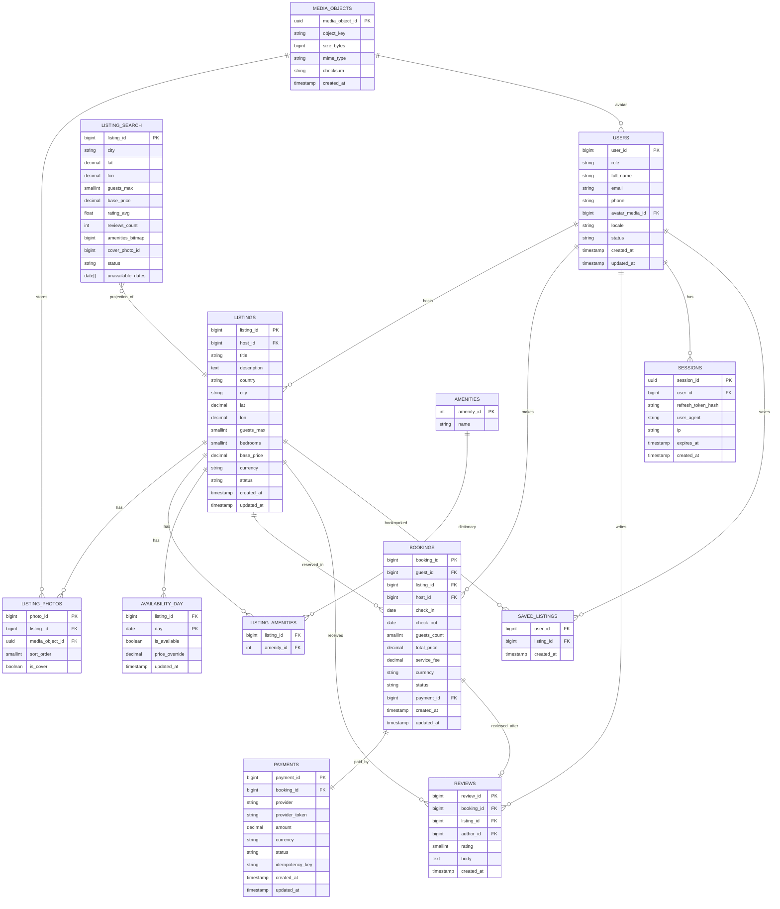

# 1. Сервис краткосрочной аренды жилья (Airbnb)

Airbnb — международная онлайн-платформа для размещения и поиска краткосрочной аренды жилья. Пользователи могут сдавать своё жильё в аренду или бронировать доступные варианты по всему миру через веб-интерфейс или мобильное приложение. Сервис действует в сотнях стран, предлагает миллионы объектов размещения и связывает гостей с хозяевами по всему миру. [[1](https://ru.wikipedia.org/wiki/Airbnb)]

## 1.1 Аналоги

* Booking.com
* Vrbo
* HomeAway
* Agoda

## 1.2 Целевая аудитория

**Аудитория:** пользователи 18–65 лет, планирующие путешествия, командировки и краткосрочные проживания, а также владельцы жилья, сдающие его в аренду.

**География:** глобальная (220+ стран и регионов). [[2](https://www.demandsage.com/airbnb-statistics)]

**Размер аудитории для моделирования нагрузки:**

* Более **150 млн активных пользователей** во всём мире (оценка на 2025–2026). [[3](https://hotelagio.com/airbnb-statistics)]
* Более **200 млн зарегистрированных пользователей** по оценкам сторонних источников. [[4](https://www.businessofapps.com/data/airbnb-statistics/)]

## 1.3 Функционал для проектирования MVP

1. **Поиск жилья:** поиск по локации, датам, числу гостей и фильтры
2. **Каталог объявлений:** карточки объектов, фото, описание, отзывы
3. **Календарь доступности:** отображение доступных и занятых дат, а также синхронизация изменений
4. **Бронирование:** формирование запроса брони, проверка пересечений с другими пользователями
5. **Онлайн-платёж:** интеграция с платёжным провайдером, обработка состояний транзакций
6. **Личный кабинет:** история бронирований, управление объявлениями для хозяев
7. **Отзывы и рейтинги:** после завершения проживания

# 1.4 Продуктовые метрики

| Метрика                                 | Значение | Комментарий / назначение        |
| --------------------------------------- | -------- | ------------------------------- |
| MAU (Monthly Active Users)              | 150 млн  | Активные пользователи в месяц |
| DAU (Daily Active Users)                | 25 млн   | Оценка как 15–20% от MAU        |
| Количество объявлений                   | 8 млн    | Активные листинги на платформе |
| Количество бронирований в год           | 490 млн  | По данным статистики Airbnb |
| Количество бронирований в день          | 1.34 млн | 490 млн / 365                   |
| Количество поисковых запросов в день    | 200 млн  | В среднем 8 поисков на пользователя |
| Количество новых объявлений в день      | 50 тыс   | Добавление нового жилья         |
| Количество отзывов в день               | 500 тыс  | После завершения проживания     |

---

# 2. Расчёт нагрузки

## 2.1 Продуктовые метрики

### Исходные данные

| MAU (Monthly Active Users), млн | DAU (Daily Active Users), млн |
|---------------------------------|-------------------------------|
| 150                             | 25                            |

### Stickiness Factor (SF)

Stickiness Factor (SF) показывает, какая доля MAU возвращается ежедневно:

$$SF = \frac{DAU}{MAU} = \frac{25}{150} \approx 16.7\%$$

Для платформы путешествий это ожидаемо: пользователи заходят в период планирования поездки, а не каждый день.

### Average User Storage (AUS)

AUS (Average User Storage) — средний объём реляционных данных на одного пользователя. Медиафайлы вынесены в отдельный раздел.

**Среднее число бронирований на пользователя** считается из метрик задания 1:

$$\frac{490 \text{ млн бронирований/год}}{150 \text{ млн MAU}} \approx 3.3 \text{ поездки/год}$$

Оба числа — из задания 1: 490 млн бронирований [[5](https://investors.airbnb.com)], MAU 150 млн [[2](https://www.demandsage.com/airbnb-statistics)].

Горизонт хранения — 3 года — проектное решение: храним историю бронирований за последние 3 года. Итого: 3.3 × 3 ≈ **9 бронирований на пользователя**.

Размер одной записи бронирования:

| Поле                     | Описание                                                                                                                               | Тип               | Байт    |
|--------------------------|----------------------------------------------------------------------------------------------------------------------------------------|-------------------|---------|
| booking_id               | уникальный идентификатор бронирования                                                                                                  | int64             | 8       |
| user_id                  | идентификатор гостя                                                                                                                    | int64             | 8       |
| listing_id               | идентификатор объявления об аренде                                                                                                     | int64             | 8       |
| host_id                  | идентификатор владельца жилья — денормализован в запись, чтобы не делать объединение с таблицей объявлений при выплатах и уведомлениях | int64             | 8       |
| check_in, check_out      | даты заезда и выезда                                                                                                                   | date × 2          | 8       |
| total_price, service_fee | итоговая стоимость и сервисный сбор                                                                                                    | DECIMAL(10,2) × 2 | 16      |
| currency                 | валюта оплаты (ISO 4217, напр. USD)                                                                                                    | char(3)           | 4       |
| guests_count             | количество гостей                                                                                                                      | int8              | 1       |
| status                   | статус брони (ожидание / подтверждено / отменено / завершено)                                                                          | int8 (enum)       | 1       |
| payment_id               | идентификатор транзакции в платёжной системе                                                                                           | int64             | 8       |
| created_at, updated_at   | время создания и последнего изменения записи                                                                                           | timestamp × 2     | 16      |
| special_requests         | пожелания гостя, произвольный текст (в среднем ~80 символов)                                                                           | text              | 80      |
| **Итого (поля)**         |                                                                                                                                        |                   | **166** |

Сырых данных: 166 байт. Индексы по полям `user_id` и `listing_id` (тип B-tree, ~50 байт каждый) добавляют ещё 100 байт. С учётом служебного заголовка строки PostgreSQL (~24 байта [[6](https://www.postgresql.org/docs/current/storage-page-layout.html#STORAGE-TUPLE-LAYOUT)]): 166 + 100 + 24 ≈ **~300 байт**.

Оценки размеров остальных сущностей:

- **Профиль (600 байт)** — имя, email, телефон, ссылка на аватар, настройки уведомлений, язык
- **Сохранённое объявление (50 байт)** — пара (user_id, listing_id) + дата добавления
- **Отзыв (500 байт)** — текст (~300 символов в среднем), числовой рейтинг, дата, идентификаторы гостя и объявления
- **Платёжный токен (200 байт)** — токен карты от платёжного провайдера, тип карты, последние 4 цифры для отображения

| Сущность               | Кол-во записей | Размер записи, байт | Итого, байт        |
|------------------------|----------------|---------------------|--------------------|
| Профиль                | 1              | 600                 | 600                |
| История бронирований   | 9              | 300                 | 2700               |
| Сохранённые объявления | 40             | 50                  | 2000               |
| Написанные отзывы      | 6              | 500                 | 3000               |
| Платёжные токены       | 1              | 200                 | 200                |
| **Итого**              |                |                     | **~8500 ≈ 8.5 Кб** |

### Среднее количество действий пользователя в день (СКД)

Берётся активный пользователь из DAU. Число поисков считается из задания 1: 200 млн/день ÷ 25 млн DAU = 8. Просмотры карточек: в среднем ~1 клик на поисковый запрос — иногда пользователь открывает 2–3 варианта для сравнения, иногда не кликает вовсе (результаты не подошли). При 8 запросах в день итого ~7 просмотров. Бронирования и отзывы — доля от DAU:

- бронирования: 1.34 млн/день ÷ 25 млн DAU ≈ 0.05
- отзывы: 0.5 млн/день ÷ 25 млн DAU ≈ 0.02

| Действие                         | Среднее, шт |
|----------------------------------|-------------|
| Загрузка главной / экрана поиска | 2           |
| Поисковые запросы                | 8           |
| Просмотры карточек объявлений    | 7           |
| Проверки дат доступности         | 7           |
| Обращения к профилю / истории    | 1           |
| Оформление бронирования          | 0.05        |
| Написание отзыва                 | 0.02        |
| **Итого**                        | **~25**     |

## 2.2 Технические метрики

### 2.2.1 Хранилище

**Реляционные данные:**

Для профилей берётся 200 млн зарегистрированных пользователей [[4](https://www.businessofapps.com/data/airbnb-statistics/)], а не только активных (150 млн MAU): аккаунты хранятся независимо от активности. При этом у неактивных пользователей (50 млн) данных значительно меньше — только профиль (~0.6 Кб), без истории бронирований и отзывов. Итоговый расчёт: 150 млн × 8.5 Кб + 50 млн × 0.6 Кб ≈ 1.3 ТБ.

Накопленный объём бронирований оценивается за 10 лет с учётом роста платформы: в 2014–2018 годах обрабатывалось 50–270 млн бронирований в год [[5](https://investors.airbnb.com)], в 2019–2024 — 190–490 млн. Суммарно за 10 лет — около 3 млрд записей.

Накопленный объём отзывов: по данным Airbnb, на платформе размещено более 1 млрд отзывов [[7](https://news.airbnb.com/about-us)]. Берём 1 200 млн как оценку с запасом.

| Сущность                   | Расчёт                                                                                           | Объём       |
|----------------------------|--------------------------------------------------------------------------------------------------|-------------|
| Профили пользователей      | 150 млн × 8.5 Кб + 50 млн × 0.6 Кб [[4](https://www.businessofapps.com/data/airbnb-statistics/)] | ~1.3 ТБ     |
| Объявления об аренде       | 8 млн × 3 Кб [[7](https://news.airbnb.com/about-us)]                                             | ~24 ГБ      |
| Бронирования (накопленные) | 3 млрд × 300 байт [[5](https://investors.airbnb.com)]                                            | ~0.9 ТБ     |
| Отзывы (накопленные)       | 1 200 млн × 500 байт [[7](https://news.airbnb.com/about-us)]                                     | ~600 ГБ     |
| **Итого реляционных**      |                                                                                                  | **~2.8 ТБ** |

**Медиаконтент (хранится в объектном хранилище, раздаётся через CDN):**

| Тип                                                          | Расчёт                                                               | Объём      |
|--------------------------------------------------------------|----------------------------------------------------------------------|------------|
| Фото объявлений (в среднем 15 фото × 500 КБ)                 | 8 млн × 7.5 МБ [[7](https://news.airbnb.com/about-us)]               | ~60 ТБ     |
| Превью для поиска (те же 15 фото, уменьшены до 80 КБ каждое) | 8 млн × 1.2 МБ [[8](https://almanac.httparchive.org)]                | ~9.6 ТБ    |
| Фотографии профилей                                          | 150 млн × 150 КБ [[2](https://www.demandsage.com/airbnb-statistics)] | ~22.5 ТБ   |
| **Итого медиа**                                              |                                                                      | **~92 ТБ** |

**Общий объём хранилища: ~95 ТБ**

### 2.2.2 Сетевой трафик

Основной трафик — загрузка фотографий при просмотре объявлений. Поисковый ответ — список результатов в формате JSON с небольшими превью (~50 КБ). Страница конкретного объявления — несколько полноразмерных фото плюс метаданные, в среднем ~1 МБ.

25 млн DAU × 7 просмотров = 175 млн загрузок страниц в день. Перевод в Гбит/с: 175 ТБ × 1000 ГБ/ТБ × 8 Гбит/ГБ ÷ 86 400 с ≈ 16.2 Гбит/с.

| Тип запроса                            | Суточный объём          | Средняя нагрузка | Пик (×2.5)     |
|----------------------------------------|-------------------------|------------------|----------------|
| Поиск (выдача + превью)                | 200 млн × 50 КБ = 10 ТБ | 0.93 Гбит/с      | 2.3 Гбит/с     |
| Загрузка страниц объявлений            | 175 млн × 1 МБ = 175 ТБ | 16.2 Гбит/с      | 40.5 Гбит/с    |
| Прочие запросы (профиль, бронирование) | 50 млн × 5 КБ = 0.25 ТБ | 0.02 Гбит/с      | 0.06 Гбит/с    |
| **Итого**                              | **~185 ТБ/сут**         | **~17.2 Гбит/с** | **~43 Гбит/с** |

94% пикового трафика приходится на загрузку фото объявлений (40.5 из 43 Гбит/с), что делает раздачу медиа через CDN (Content Delivery Network) обязательным архитектурным решением, а не опциональным.

### 2.2.3 RPS

RPS (Requests Per Second) — количество запросов к серверу в секунду. Пиковая нагрузка принята в 3× от среднесуточной.

При открытии страницы объявления браузер делает два отдельных запроса: один за данными объявления, второй — за календарём доступности. Итого запросов к сервису доступности: 175 млн/день (1:1 к просмотрам страниц).

Авторизация и обращения к профилю: 25 млн DAU × 2 запроса (вход + обновление сессии) = 50 млн/день.

| Действие                 | Запросов/день | RPS (среднее) | RPS (пик ×3) |
|--------------------------|---------------|---------------|--------------|
| Поиск                    | 200 млн       | 2315          | 6945         |
| Страницы объявлений      | 175 млн       | 2025          | 6075         |
| Проверка доступности дат | 175 млн       | 2025          | 6075         |
| Бронирование             | 1.34 млн      | 15.5          | 47           |
| Новые объявления         | 0.05 млн      | 0.6           | 2            |
| Отзывы                   | 0.5 млн       | 5.8           | 17           |
| Авторизация / профиль    | 50 млн        | 578           | 1734         |
| **Итого**                |               | **~6965**     | **~20895**   |

### Итоговая таблица продуктовых метрик

| Метрика                              | Значение |
|--------------------------------------|----------|
| MAU                                  | 150 млн  |
| DAU                                  | 25 млн   |
| Stickiness                           | 16.7%    |
| Средний объём данных на пользователя | 8.5 КБ   |
| Среднее число действий в день        | 25       |
| Бронирований на пользователя         | 9        |

---

# 3. Глобальная балансировка нагрузки

## 3.1 Разделение трафика на группы по характеру нагрузки

Трафик разделяется на группы по типу операции и требованиям к задержке и согласованности данных:

| Группа | Тип нагрузки | Примеры запросов | Как масштабируем / требования |
|:---------------------|:---------------------------------------------------------------|:-------------------------------------------------------------------------------------|:--------------------------------------------------------------------------------------------------------------------------------|
| Чтение, публичные | Поиск, карточки объявлений, чтение отзывов, чтение доступности | поиск (200 млн/день), страницы объявлений (175 млн/день), доступность (175 млн/день) | Масштабируем горизонтально (несколько экземпляров сервиса). Для чтений возможны реплики БД. Допустима итоговая согласованность. |
| Чтение, персональное | Профиль, история, сессия | авторизация/профиль (50 млн/день) | Обрабатывается серверами приложения с доступом к БД. Требования по приватности и целостности данных пользователя. |
| Запись, критичная | Бронирование, платежи, транзакции | бронирование (1.34 млн/день), новые объявления (50 тыс/день), отзывы (500 тыс/день) | Все операции записи выполняются через основную БД для обеспечения согласованности данных. |

## 3.2 Физическое расположение датацентра

Один основной ДЦ в Амстердаме, Западная Европа. Причины:

* близко к крупному рынку Европы, что снижает задержку для значимой доли пользователей;
* проще соблюдение требований регулятора GDPR (General Data Protection Regulation);
* для MVP проще обеспечить транзакционную целостность (бронь/платежи) без меж-ДЦ согласования.

## 3.3 Схема глобальной балансировки до датацентра

Так как в системе используется один датацентр, глобальная балансировка между датацентрами отсутствует: все запросы в итоге попадают в один и тот же ДЦ.

Глобальная схема маршрутизации запросов:

* Пользователь выполняет DNS-запрос доменного имени (`www.airbnb.com`, `api.airbnb.com`, `img.airbnb.com`, `static.airbnb.com`)
* DNS возвращает адрес CDN/WAF (единая точка входа)
* CDN/WAF принимает запрос и дальше маршрутизирует его:
  * статика и изображения (`img.airbnb.com`, `static.airbnb.com`) отдаются с CDN (кэш)
  * запросы сайта (`www.airbnb.com`) и API-запросы (`api.airbnb.com`) проксируются в основной датацентр (ДЦ в Амстердаме)

Таким образом, на глобальном уровне:
* ускоряем доставку статического контента за счёт CDN,
* весь серверный трафик приложения обрабатывается в одном датацентре.


## 3.4 Функциональное разбиение по доменным именам

| Публичная точка входа | Адрес               | Назначение                               | Куда ведёт                             |
|-----------------------|---------------------|------------------------------------------|----------------------------------------|
| Web                   | `www.airbnb.com`    | сайт/SPA/SSR                             | CDN/WAF (проксирование) → основной ДЦ  |
| Public API            | `api.airbnb.com`    | поиск/карточки/доступность/профиль/бронь | CDN/WAF (проксирование) → основной ДЦ  |
| Media                 | `img.airbnb.com`    | фото объявлений/аватары                  | CDN (кэш) → объектное хранилище (в ДЦ) |
| Static                | `static.airbnb.com` | JS/CSS                                   | CDN (кэш)                              |

## 3.5 Обоснование расположения ДЦ

Основной продуктовый риск “далёкого” датацентра — рост задержек на интерактивные операции (поиск, карточка, проверка дат, бронирование). Увеличение задержки на десятки–сотни миллисекунд ухудшает поведение пользователей и конверсию [[9](https://www.thinkwithgoogle.com/_qs/documents/9757/Milliseconds_Make_Millions_report_hQYAbZJ.pdf)].

CDN снимает основную нагрузку по трафику: фото и статика приходят из ближайшей точки присутствия, а в датацентр уходят только API-запросы с небольшим объёмом ответа.

Типичные задержки до Западной Европы:

* Европа: ~20–60 мс
* США (восточное побережье): ~80–140 мс
* Азия: ~150–250+ мс

Вывод: один ДЦ в Западной Европе + CDN для контента даёт хороший баланс скорости и простоты для MVP.

## 3.6 Распределение запросов по типам по датацентру

Так как используется один датацентр, то 100% API-запросов обрабатываются в нём.

Масштабирование достигается за счёт балансировщика нагрузки, нескольких серверов приложения и реплик базы данных для операций чтения.

| Тип запроса              | Запросов/день |          RPS (пик ×3) | Где обрабатывается                                                        |
|--------------------------|--------------:|----------------------:|---------------------------------------------------------------------------|
| Поиск                    |       200 млн |                  6945 | ДЦ (серверы приложения + реплики БД для чтения)                           |
| Страницы объявлений      |       175 млн |                  6075 | ДЦ (серверы приложения + реплики БД для чтения)                           |
| Проверка доступности дат |       175 млн |                  6075 | ДЦ (чтение с реплик; финальная проверка при бронировании — в основной БД) |
| Бронирование             |      1.34 млн |                    47 | ДЦ (запись → основная БД)                                                 |
| Новые объявления         |        50 тыс |                     2 | ДЦ (запись → основная БД)                                                 |
| Отзывы                   |       500 тыс |                    17 | ДЦ (запись → основная БД)                                                 |
| Авторизация / профиль    |        50 млн |                  1734 | ДЦ (серверы приложения + БД)                                              |
| **Итого**                |               | **~20 895 RPS (пик)** | **один ДЦ**                                                               |

---

# 4. Локальная балансировка нагрузки

## 4.1 Схема входящей балансировки

После глобального уровня `DNS → CDN/WAF → ДЦ` входящий трафик попадает на **L4-балансировщик** (управляемый облачным провайдером), который не выполняет SSL termination, а лишь проксирует TCP-соединения на пул L7-балансировщиков.

**L7-балансировщики (NGINX Ingress Controller)** выполняют:
- терминацию TLS;
- маршрутизацию по hostname;
- health-check backend-сервисов;
- балансировку запросов между репликами сервисов.

Распределение запросов между репликами сервисов выполняется по алгоритму **round-robin**, поскольку все сервисы stateless — состояние пользователя хранится в БД и Redis, а не в памяти сервера.



## 4.2 Разбиение трафика на группы по доменам

`img.airbnb.com` и `static.airbnb.com` полностью обслуживаются CDN и через ingress ДЦ **не проходят**.

| Группа | Домен | Балансировщик | Метод | SSL termination |
|--------|-------|---------------|-------|----------------|
| Все домены | все | облачный L4 | L4 IP (Virtual Server via NAT) | нет |
| API | `api.airbnb.com` | NGINX Ingress | L7 HTTP (reverse proxy) | L7 (NGINX) |
| Web | `www.airbnb.com` | NGINX Ingress | L7 HTTP (reverse proxy) | L7 (NGINX) |
| Media | `img.airbnb.com` | CDN | — | CDN |
| Static | `static.airbnb.com` | CDN | — | CDN |

## 4.3 Расчёт количества L7-балансировщиков

### Общие входные параметры

| Параметр | Значение | Источник                              |
|----------|---------|---------------------------------------|
| Производительность NGINX на 1 vCPU (HTTPS) | 350 TLS handshakes/с | NGINX SSL Performance Report [[11]](https://cdn.studio.f5.com/files/k6fem79d/production/2805bffce067ef760a8fa8939d7dd8b443a5e5f6.pdf) |
| Коэффициент новых TLS-соединений k | 1.0 (консервативная оценка) | проектное решение                     |
| Схема резервирования | N+1 | —                                     |

Пиковый RPS берётся из раздела 2.2.3.

### Группа `api.airbnb.com`

RPS_peak = **20 895** (суммарно по всем API-запросам из раздела 2.2.3).

$$CPS_{peak} = RPS_{peak} \times k = 20895 \times 1 = 20895 \text{ соединений/с}$$

Требуемое количество vCPU для SSL-терминации:

$$vCPU = \left\lceil \frac{CPS_{peak}}{350} \right\rceil = \left\lceil \frac{20895}{350} \right\rceil = \lceil 59.7 \rceil = 60 \text{ vCPU}$$

Количество нод при профиле **8 vCPU**:

$$N_{work} = \left\lceil \frac{60}{8} \right\rceil = 8, \quad N_{total} = 8 + 1 = 9$$

Проверка по полосе пропускания: пиковый API-трафик через ingress ≈ **3.6 Гбит/с** << 9 × 8 Гбит/с = 72 Гбит/с → полоса не является ограничителем.

| Параметр | Значение |
|----------|---------|
| RPS_peak | 20 895 |
| CPS_peak (k=1) | 20 895 |
| Ограничитель | SSL CPS |
| Требуется vCPU | 60 |
| Профиль ноды | 8 vCPU |
| N_work | 8 |
| **N_total (N+1)** | **9** |

### Группа `www.airbnb.com`

Загрузка SPA-оболочки: 25 млн DAU × 2 загрузки = 50 млн/день.

$$RPS_{avg} = \frac{50 \text{ млн}}{86400} = 578, \quad RPS_{peak} = 578 \times 3 = 1734$$

$$CPS_{peak} = 1734 \times 1 = 1734 \text{ conn/s}$$

$$vCPU = \left\lceil \frac{1734}{350} \right\rceil = \lceil 4.95 \rceil = 5 \text{ vCPU}$$

При профиле **4 vCPU**:

$$N_{work} = \left\lceil \frac{5}{4} \right\rceil = 2, \quad N_{total} = 2 + 1 = 3$$

| Параметр | Значение |
|----------|---------|
| RPS_peak | 1 734 |
| CPS_peak (k=1) | 1 734 |
| Ограничитель | SSL CPS |
| Требуется vCPU | 5 |
| Профиль ноды | 4 vCPU |
| N_work | 2 |
| **N_total (N+1)** | **3** |

## 4.4 Итоговая сводная таблица L7

| Группа | Домен | Балансировщик | Метод | SSL termination | N_work | N_total | CPU на ноду | Итого CPU |
|--------|-------|---------------|-------|----------------|--------|---------|-------------|-----------|
| API | `api.airbnb.com` | NGINX Ingress | L7 HTTP (reverse proxy) | L7 (NGINX) | 8 | 9 | 8 vCPU | 72 vCPU |
| Web | `www.airbnb.com` | NGINX Ingress | L7 HTTP (reverse proxy) | L7 (NGINX) | 2 | 3 | 4 vCPU | 12 vCPU |
| **Итого** | | | | | **10** | **12** | | **84 vCPU** |

## 4.5 Межсервисная балансировка (Kubernetes)

Межсервисное взаимодействие реализовано средствами Kubernetes Service Discovery. Распределение трафика между pod-ами выполняется по round-robin через kube-proxy в режиме IPVS.


| Тип взаимодействия | Механизм | Метод балансировки |
|---|---|---|
| Внешний запрос → сервис | NGINX Ingress Controller | L7 HTTP (reverse proxy) |
| Сервис → сервис | Kubernetes Service (ClusterIP) | L4 (kube-proxy IPVS) |
| Разрешение имени сервиса | CoreDNS | DNS |
| Хранение списка pod-ов | EndpointSlice | - |

На каждый межсервисный вызов применяются: таймаут, ретрай только для идемпотентных операций, circuit breaker на стороне клиента.

## 4.6 Отказоустойчивость

| Уровень | Механизм | Поведение при отказе |
|---------|---------|---------------------|
| L4 | управляемый балансировщик облака | HA обеспечивается провайдером |
| L7 API | N+1, 9 нод | при отказе 1 ноды оставшиеся 8 покрывают пиковую нагрузку |
| L7 Web | N+1, 3 ноды | при отказе 1 ноды оставшиеся 2 покрывают нагрузку |
| Kubernetes pods | 2–3 реплики на сервис, размещены на разных узлах | health-check исключает недоступные реплики |

---

# 5. Логическая схема данных

## 5.1 Проверка полноты данных для API

| Функционал MVP | Сущности модели данных |
|---|---|
| **Поиск жилья** | `listing_search` (содержит `unavailable_dates`) |
| **Карточка объявления** | `listings`, `listing_photos`, `reviews`, `users` |
| **Календарь доступности** | `availability_day`, `listings` |
| **Бронирование** | `users`, `listings`, `availability_day`, `bookings` |
| **Онлайн-платёж** | `payments`, `bookings`, `users` |
| **Личный кабинет гостя** | `users`, `bookings`, `payments`, `reviews`, `saved_listings` |
| **Личный кабинет хозяина** | `users`, `listings`, `bookings`, `reviews` |
| **Отзывы и рейтинги** | `reviews`, `bookings`, `listings`, `users` |

Ключевой путь бронирования:
```
users → listings → availability_day → bookings → payments
```

## 5.2 Логическая схема сущностей



## 5.3 Описание основных таблиц

**LPS (Lines Per Second)** — количество строк, которое база данных реально читает в секунду. Считается как:

$$LPS = RPS_{peak} \times rows\_per\_query$$

Это важнее чем просто RPS, потому что один запрос может читать десятки строк — например, поиск возвращает 20 листингов, карточка объявления — 15 фотографий.

| Таблица | Размер строки | Число строк | Общий размер | Peak read RPS | Rows per query | **LPS (чтение)** | Peak write RPS | Консистентность |
|---------|--------------|-------------|--------------|---------------|----------------|-----------------|----------------|----------------|
| `users` | ~600 B | 200 млн | ~120 ГБ | 1 734 | 1 | **1 734** | ~10 | strong |
| `sessions` | ~200 B | 50 млн | ~10 ГБ | 1 734 | 1 | **1 734** | ~600 | strong |
| `listings` | ~3 КБ | 8 млн | ~24 ГБ | 6 075 | 1 | **6 075** | ~5 | eventual read |
| `listing_search` | ~256 B | 8 млн | ~2 ГБ | 6 945 | 20 | **138 900** | ~5 | eventual |
| `listing_photos` | ~200 B | 120 млн | ~24 ГБ | 6 075 | 15 | **91 125** | ~30 | eventual |
| `availability_day` | ~32 B | 2.9 млрд | ~93 ГБ | 6 075 | 30 | **182 250** | ~150 | strong |
| `bookings` | ~300 B | 3 млрд | ~0.9 ТБ | 900 | 1 | **900** | ~47 | strong |
| `payments` | ~200 B | 3 млрд | ~600 ГБ | 100 | 1 | **100** | ~100 | strong |
| `reviews` | ~500 B | 1.2 млрд | ~600 ГБ | 3 000 | 10 | **30 000** | ~17 | eventual |
| `saved_listings` | ~50 B | 6 млрд | ~300 ГБ | 500 | 40 | **20 000** | ~50 | eventual |

### Пояснения к rows_per_query

| Таблица | Откуда берётся rows_per_query |
|---------|-------------------------------|
| `listing_search` | поисковая выдача возвращает 20 результатов на страницу |
| `listing_photos` | в среднем 15 фото на объявление, читаются все при открытии карточки |
| `availability_day` | проверка доступности за 30 дней (типичный горизонт поиска) |
| `reviews` | на карточке показывается до 10 последних отзывов |
| `saved_listings` | пользователь видит до 40 сохранённых объявлений в списке |

## 5.4 Анализ JOIN-ов по ключевым сценариям

### Сценарий 1: Поиск жилья

Запрос идёт **только в `listing_search`** — это денормализованная проекция, которая содержит всё необходимое для выдачи (цена, рейтинг, геолокация, удобства, обложка, занятые даты). JOIN не нужен.

| Таблица | Строк на запрос | Операция |
|---------|----------------|---------|
| `listing_search` | 20 | index scan по `(city, status, guests_max)` + фильтр `unavailable_dates NOT IN [check_in..check_out]` |
| **Итого** | **20 строк** | без JOIN |

### Сценарий 2: Карточка объявления

| Таблица | Строк на запрос | Операция |
|---------|----------------|---------|
| `listings` | 1 | PK lookup по `listing_id` |
| `listing_photos` | 15 | index scan по `(listing_id, sort_order)` |
| `reviews` | 10 | index scan по `(listing_id, created_at DESC)` |
| `users` (хозяин) | 1 | PK lookup по `host_id` |
| **Итого** | **27 строк** | 3 JOIN |

LPS при пиковой нагрузке: 6 075 × 27 = **164 025 строк/с**

### Сценарий 3: Проверка доступности дат

| Таблица | Строк на запрос | Операция |
|---------|----------------|---------|
| `availability_day` | 30 | index scan по `(listing_id, day)` за выбранный диапазон |
| **Итого** | **30 строк** | без JOIN |

### Сценарий 4: Бронирование (запись)

Транзакционная операция — читаем перед записью:

| Таблица | Строк | Операция |
|---------|-------|---------|
| `users` | 1 | PK lookup (проверка гостя) |
| `listings` | 1 | PK lookup (проверка объявления) |
| `availability_day` | 30 | index scan (финальная проверка пересечений) |
| `bookings` (запись) | 1 | INSERT |
| `payments` (запись) | 1 | INSERT |
| `availability_day` (запись) | 30 | UPDATE (пометить даты занятыми) |
| **Итого чтений** | **32 строки** | 2 JOIN + транзакция |

## 5.5 Требования к консистентности

### Strong consistency

Нужна там, где ошибка приводит к двойному бронированию или финансовой потере:

- `bookings` — запись брони должна быть атомарной
- `payments` — платёж не должен дублироваться, используется `idempotency_key`
- `availability_day` — финальная проверка и обновление в одной транзакции
- `sessions` — сессия должна читаться однозначно

### Eventual consistency

Допустима там, где задержка в несколько секунд не ломает продукт:

- `listing_search` — поисковая проекция обновляется асинхронно после изменения объявления
- `listing_photos`, `reviews` — новый контент может появиться с задержкой
- `saved_listings` — некритично

## 5.6 Особенности распределения нагрузки по ключам

| Таблица | Ключ нагрузки | Характер |
|---------|--------------|---------|
| `users` | `user_id` | равномерное |
| `sessions` | `session_id` | равномерное |
| `listings` | `listing_id`, `city` | перекос по популярным городам |
| `listing_search` | `(city, guests_max, price)` | сильный перекос по популярным направлениям |
| `availability_day` | `(listing_id, day)` | hot keys на популярных объявлениях и праздничных датах |
| `bookings` | `listing_id` | конкуренция за популярные объявления |
| `reviews` | `listing_id` | чтение смещено в популярные объявления |
| `saved_listings` | `user_id` | равномерное по записи, hot keys по популярным `listing_id` |

### Вывод по hot keys

Основная неравномерность — не по `user_id`, а по:
- `listing_id` — популярные объявления
- `(listing_id, day)` — доступность в сезон и праздники
- `(city, check_in, check_out, guests)` — поисковые запросы по топ-направлениям

---

# 6. Физическая схема данных

## 6.1 Выбор хранилищ

| Хранилище | Что хранится | Почему |
|-----------|-------------|--------|
| **PostgreSQL 16** | `users`, `sessions`, `listings`, `listing_photos`, `media_objects`, `amenities`, `listing_amenities`, `availability_day`, `bookings`, `payments`, `reviews`, `saved_listings` | транзакционные данные, strong consistency, ACID |
| **Elasticsearch 8** | `listing_search` | полнотекстовый поиск, фильтры по геолокации, сортировка, агрегации — PostgreSQL с GIN-индексом не справится при 138 900 LPS |
| **Redis 7** | сессии, кэш карточек | sub-millisecond latency на горячих чтениях |
| **Kafka** | события изменения объявлений, обновления доступности, медиа-события | асинхронное обновление Elasticsearch, развязка OLTP и поиска |
| **S3-совместимое объектное хранилище** | фото объявлений, превью, аватары | бинарные файлы вне PostgreSQL |
| **CDN** | раздача медиа и статики | 94% медиатрафика — не нагружать origin |

Чтобы не смешивать разные ключи шардирования, PostgreSQL разбит на два кластера:

- **user-cluster** — шардируется по `user_id`
- **core-cluster** — шардируется по `listing_id`

## 6.2 Физическая схема

```mermaid
flowchart TB
    subgraph U["PostgreSQL 16 / user-cluster
    8 shards by HASH(user_id)
    each shard: primary + 2 replicas"]
        USERS["users
        PK(user_id)
        UNIQUE(email)
        UNIQUE(phone)
        IDX(created_at)"]
        SESSIONS["sessions
        PK(session_id)
        IDX(user_id)
        IDX(expires_at)"]
        SAVED["saved_listings
        PK(user_id, listing_id)
        IDX(listing_id, created_at DESC)"]
    end

    subgraph C["PostgreSQL 16 / core-cluster
    16 shards by HASH(listing_id)
    each shard: primary + 2 replicas"]
        LISTINGS["listings
        PK(listing_id)
        IDX(host_id, created_at DESC)
        IDX(city, status)
        GiST(lat, lon)"]
        PHOTOS["listing_photos
        PK(photo_id)
        IDX(listing_id, sort_order)"]
        AVAIL["availability_day
        PK(listing_id, day)
        PARTITION BY RANGE(day) monthly"]
        BOOKINGS["bookings
        PK(booking_id)
        IDX(guest_id, created_at DESC)
        IDX(host_id, created_at DESC)
        IDX(listing_id, check_in)"]
        PAY["payments
        PK(payment_id)
        UNIQUE(booking_id)
        UNIQUE(idempotency_key)"]
        REV["reviews
        PK(review_id)
        UNIQUE(booking_id)
        IDX(listing_id, created_at DESC)"]
        MEDIA["media_objects
        PK(media_object_id)
        UNIQUE(object_key)"]
        LAM["listing_amenities
        PK(listing_id, amenity_id)"]
        AM["amenities
        PK(amenity_id)
        reference table"]
    end

    subgraph ES["Elasticsearch 8
    12 primary shards + 1 replica each"]
        LSEARCH["listing_search
        doc_id = listing_id
        IDX: city, status, guests_max
        IDX: base_price, rating_avg
        IDX: lat/lon (geo_point)
        IDX: amenities_bitmap
        IDX: unavailable_dates"]
    end

    subgraph RS["Redis 7 / session-cluster
    3 masters + 3 replicas"]
        SESS["session:{session_id}
        TTL 30d
        AOF everysec"]
    end

    subgraph RC["Redis 7 / cache-cluster
    6 masters + 6 replicas"]
        LC["listing_card:{listing_id}
        TTL 5m
        includes availability array[365]"]
    end

    subgraph KF["Kafka
    3 brokers, replication factor 3"]
        K1["listing-updates
        partitioned by listing_id"]
        K2["availability-updates
        partitioned by listing_id"]
        K3["media-events
        partitioned by listing_id"]
    end

    subgraph S3["S3-compatible object storage"]
        OBJ["photos / previews / avatars
        key = object_key"]
    end

    USERS --> BOOKINGS
    USERS --> REV
    USERS --> SAVED
    LISTINGS --> PHOTOS
    LISTINGS --> LAM
    LISTINGS --> AVAIL
    LISTINGS --> BOOKINGS
    LISTINGS --> REV
    BOOKINGS --> PAY
    PHOTOS --> MEDIA
    MEDIA --> OBJ
    LISTINGS -->|"async via Kafka"| LSEARCH
    K1 --> LSEARCH
    K2 --> LSEARCH
```



## 6.3 Таблицы, индексы и шардирование

| Таблица | СУБД / кластер | Размер строки | Число строк | Общий размер | Индексы | Шардирование | Репликация |
|---------|---------------|--------------|-------------|--------------|---------|-------------|-----------|
| `users` | PostgreSQL / user-cluster | ~600 B | 200 млн | ~120 ГБ | `PK(user_id)`, `UNIQUE(email)`, `UNIQUE(phone)`, `IDX(created_at)` | `HASH(user_id)`, 8 shards | primary + 2 replicas |
| `sessions` | PostgreSQL / user-cluster | ~200 B | 50 млн | ~10 ГБ | `PK(session_id)`, `IDX(user_id)`, `IDX(expires_at)` | `HASH(user_id)`, 8 shards | primary + 2 replicas |
| `saved_listings` | PostgreSQL / user-cluster | ~50 B | 6 млрд | ~300 ГБ | `PK(user_id, listing_id)`, `IDX(listing_id, created_at DESC)` | `HASH(user_id)`, 8 shards | primary + 2 replicas |
| `listings` | PostgreSQL / core-cluster | ~3 КБ | 8 млн | ~24 ГБ | `PK(listing_id)`, `IDX(host_id, created_at DESC)`, `IDX(city, status)`, `GiST(lat, lon)` | `HASH(listing_id)`, 16 shards | primary + 2 replicas |
| `listing_photos` | PostgreSQL / core-cluster | ~200 B | 120 млн | ~24 ГБ | `PK(photo_id)`, `IDX(listing_id, sort_order)`, `UNIQUE(listing_id, sort_order)` | `HASH(listing_id)`, 16 shards | primary + 2 replicas |
| `amenities` | PostgreSQL / core-cluster | ~64 B | ~100 | мало | `PK(amenity_id)` | reference table на всех shards | replication to all shards |
| `listing_amenities` | PostgreSQL / core-cluster | ~24 B | 160 млн | ~3.8 ГБ | `PK(listing_id, amenity_id)`, `IDX(amenity_id)` | `HASH(listing_id)`, 16 shards | primary + 2 replicas |
| `availability_day` | PostgreSQL / core-cluster | ~32 B | 2.9 млрд | ~93 ГБ | `PK(listing_id, day)`, `IDX(updated_at)` | `HASH(listing_id)`, 16 shards; внутри шарда `RANGE(day)` по месяцам | primary + **1 синхронная** replica + 1 async |
| `bookings` | PostgreSQL / core-cluster | ~300 B | 3 млрд | ~0.9 ТБ | `PK(booking_id)`, `IDX(guest_id, created_at DESC)`, `IDX(host_id, created_at DESC)`, `IDX(listing_id, check_in)`, `IDX(status, created_at DESC)` | `HASH(listing_id)`, 16 shards | primary + **1 синхронная** replica + 1 async |
| `payments` | PostgreSQL / core-cluster | ~200 B | 3 млрд | ~600 ГБ | `PK(payment_id)`, `UNIQUE(booking_id)`, `UNIQUE(idempotency_key)`, `IDX(status, created_at DESC)` | колоцирован с `bookings` по `listing_id`, 16 shards | primary + **1 синхронная** replica + 1 async |
| `reviews` | PostgreSQL / core-cluster | ~500 B | 1.2 млрд | ~600 ГБ | `PK(review_id)`, `UNIQUE(booking_id)`, `IDX(listing_id, created_at DESC)`, `IDX(author_id, created_at DESC)` | `HASH(listing_id)`, 16 shards | primary + 2 async replicas |
| `media_objects` | PostgreSQL / core-cluster | ~160 B | ~270 млн | ~43 ГБ | `PK(media_object_id)`, `UNIQUE(object_key)`, `IDX(created_at)` | `HASH(listing_id)`, 16 shards | primary + 2 replicas |
| `listing_search` | **Elasticsearch 8** | ~256 B | 8 млн | ~2 ГБ | `geo_point(lat, lon)`, `IDX(city, status, guests_max)`, `IDX(base_price)`, `IDX(rating_avg)`, `IDX(amenities_bitmap)`, `IDX(unavailable_dates)` | 12 primary shards, 1 replica each | 1 replica per shard |

## 6.4 Денормализация

| Объект | Денормализация | Зачем |
|--------|---------------|-------|
| `bookings` | хранит `host_id`, `total_price`, `currency` | не читать `listings` при истории поездок и выплатах |
| `reviews` | хранит `listing_id`, `author_id` | быстро выводить отзывы по объявлению без JOIN |
| `listing_search` | хранит `city`, `lat/lon`, `guests_max`, `base_price`, `rating_avg`, `reviews_count`, `amenities_bitmap`, `cover_photo_id`, `unavailable_dates` | поиск без тяжёлых JOIN на `listings + reviews + amenities + photos + availability_day` |

`listing_search` — поисковая проекция, которая пересобирается асинхронно через Kafka при изменении объявления, фотографий, агрегата отзывов или доступности дат.

## 6.5 Кэши и буферы

### Кэши (Redis)

| Кэш | Кластер | Ключ | Размер записи | Объём hot set | TTL | Peak read RPS | Консистентность |
|-----|---------|------|--------------|--------------|-----|--------------|----------------|
| `session_cache` | session-cluster | `session:{session_id}` | ~200 B | ~10 ГБ | 30 дней | ~1 734 | strong |
| `listing_card_cache` | cache-cluster | `listing_card:{listing_id}` | ~7 КБ | ~7 ГБ | 5 минут, invalidate on update | ~6 075 | eventual |

`listing_card_cache` содержит готовую карточку объявления включая массив доступности на 365 дней (~3 КБ на массив + ~4 КБ карточка = ~7 КБ). Отдельный `availability_cache` не нужен — даты хранятся прямо в карточке.

### Буферы (Kafka)

| Топик | Продюсер | Потребитель | Партиционирование | Retention | Назначение |
|-------|---------|------------|------------------|-----------|-----------|
| `listing-updates` | Listing API | Elasticsearch indexer | `listing_id` | 3 дня | асинхронное обновление поисковой проекции |
| `availability-updates` | Booking API, Listing API | Elasticsearch indexer | `listing_id` | 3 дня | обновление `unavailable_dates` в Elasticsearch после бронирования или изменения календаря хозяином |
| `media-events` | Media API | thumbnail worker | `listing_id` | 3 дня | генерация превью после загрузки фото |

## 6.6 Шардирование и резервирование

| Кластер / сущность | Ключ шардирования | Число shards | Резервирование | Примечание |
|-------------------|------------------|-------------|---------------|-----------|
| PostgreSQL user-cluster | `HASH(user_id)` | 8 | primary + 2 async replicas | user-centric данные |
| PostgreSQL core-cluster (обычные таблицы) | `HASH(listing_id)` | 16 | primary + 2 async replicas | listing-centric данные |
| PostgreSQL core-cluster (`bookings`, `payments`, `availability_day`) | `HASH(listing_id)` | 16 | primary + **1 синхронная** + 1 async replica | strong consistency на критическом пути |
| Elasticsearch | `listing_id` | 12 primary | 1 replica per shard | поиск |
| Redis session-cluster | hash slots | 3 masters | 3 replicas | потеря сессий нежелательна |
| Redis cache-cluster | hash slots | 6 masters | 6 replicas | потеря допустима, восстанавливается из PostgreSQL |
| Kafka | `listing_id` | 3 brokers | replication factor 3 | каждое сообщение на 3 брокерах |
| S3 object storage | — | — | erasure coding | потеря диска не приводит к потере файлов |

## 6.7 Клиентские библиотеки и интеграции

| Компонент | Библиотека | Назначение |
|-----------|-----------|-----------|
| PostgreSQL | `asyncpg` + `SQLAlchemy 2` | async OLTP-запросы и транзакции |
| PostgreSQL connection pool | `PgBouncer` (transaction pooling) | мультиплексирование подключений |
| Elasticsearch | `elasticsearch-py` (async) | индексация и поисковые запросы |
| Redis | `redis-py` (cluster mode) | кэши и сессии |
| Kafka | `aiokafka` | producer и consumer для событий |
| S3 | `aioboto3` | загрузка и чтение файлов |

## 6.8 Балансировка запросов и мультиплексирование подключений

### PostgreSQL

Перед каждым шардом стоит **PgBouncer** в режиме transaction pooling, который:

- мультиплексирует клиентские соединения в меньшее число backend-соединений к PostgreSQL
- роутит **write-запросы** → primary
- роутит **read-запросы** → read replicas

```
Приложение → PgBouncer → primary  (write)
                       → replica  (read)
```

### Elasticsearch

- запросы идут через координирующую ноду кластера
- координатор сам распределяет запрос по нужным shards

### Redis

- cluster-aware клиент знает hash slots
- запрос сразу идёт на нужный master
- replica используется только для failover

### Kafka

- producer пишет в ведущий раздел по ключу `listing_id`
- consumer group читает разделы параллельно

## 6.9 Проверка нагрузки на хранилища

### PostgreSQL user-cluster

| Таблица | LPS (чтение) | Peak write RPS | Размер на shard |
|---------|-------------|---------------|----------------|
| `users` | 1 734 | ~10 | ~15 ГБ |
| `sessions` | 1 734 | ~600 | ~1.25 ГБ |
| `saved_listings` | 20 000 | ~50 | ~37.5 ГБ |
| **Итого на shard** | **~23 468 LPS** | **~660** | **~54 ГБ** |

Нагрузка небольшая — PostgreSQL на SSD легко выдерживает.

### PostgreSQL core-cluster

| Таблица | LPS (чтение) | Peak write RPS | Размер на shard |
|---------|-------------|---------------|----------------|
| `listings` | 6 075 | ~5 | ~1.5 ГБ |
| `listing_photos` | 91 125 | ~30 | ~1.5 ГБ |
| `availability_day` | 182 250 | ~150 | ~5.8 ГБ |
| `bookings` | 900 | ~47 | ~56 ГБ |
| `payments` | 100 | ~100 | ~37.5 ГБ |
| `reviews` | 30 000 | ~17 | ~37.5 ГБ |
| **Итого на shard** | **~310 450 LPS** | **~349** | **~140 ГБ** |

Основная нагрузка — `availability_day` и `listing_photos`. При 2 read replicas на shard: ~103 483 LPS на replica — допустимо.

### Elasticsearch

| Метрика | Значение |
|---------|---------|
| Peak search RPS | 6 945 |
| Rows per query | 20 |
| LPS | 138 900 |
| Размер индекса | ~2 ГБ |
| На shard | ~167 МБ |

Индекс целиком помещается в RAM — поиск работает быстро.

### Redis

| Кластер | Hot set | Peak read RPS |
|---------|---------|--------------|
| session-cluster | ~10 ГБ | ~1 734 |
| cache-cluster | ~7 ГБ | ~6 075 |

Оба hot set помещаются в RAM — нагрузка для Redis штатная.

## 6.10 Схема резервного копирования

| Компонент | Механизм | Расписание | Retention | Восстановление |
|-----------|---------|-----------|-----------|---------------|
| PostgreSQL (все кластеры) | full backup + непрерывная архивация WAL | full backup ежедневно, WAL постоянно | daily — 7 дней, weekly — 8 недель, monthly — 12 месяцев | PITR из full backup + WAL до нужного момента |
| Elasticsearch | snapshot индекса в S3 | каждые 6 часов | daily snapshots — 14 дней, weekly — 8 недель | восстановление из snapshot, затем переиндексация из Kafka или PostgreSQL |
| Redis session-cluster | AOF everysec + RDB snapshot | RDB каждые 15 минут, выгрузка в S3 ежедневно | snapshots — 3 дня, daily в S3 — 14 дней | запуск из последнего RDB; при полной потере сессии инвалидируются |
| Redis cache-cluster | RDB snapshot | ежедневно | 3 дня | при потере кэш прогревается из PostgreSQL |
| Kafka | хранение в топиках | постоянно | 3 дня | повторное чтение из топика; при полной потере переиндексация из PostgreSQL |
| S3 object storage | versioning + erasure coding | постоянно | версии — 30 дней | восстановление из версий объекта |

---

# 7. Алгоритмы

## 7.1 Проблема проверки доступности

При поиске жилья система должна из 8 млн активных объявлений отфильтровать те, у которых **все дни** в диапазоне `[check_in, check_out)` свободны. Наивный подход — для каждого кандидата делать отдельный запрос к `availability_day` — не работает:

| Проблема | Цифра |
|----------|-------|
| Активных объявлений | 8 млн |
| LPS на `availability_day` | 182 250 строк/с |
| Строк на проверку одного объявления | 30 (типичный диапазон) |
| Запросов при наивном подходе на 1 поиск | до 8 млн |

Решение разбито на два шага с разными требованиями к консистентности:

| Шаг | Где | Консистентность | Почему |
|-----|-----|----------------|--------|
| Фильтрация при поиске | Elasticsearch | eventual | скорость, масштаб — допустима задержка в секунды |
| Финальная проверка при бронировании | PostgreSQL + `FOR UPDATE` | strong | защита от double booking |

## 7.2 Индекс доступности в Elasticsearch

### Как хранится

Каждый документ `listing_search` содержит массив занятых дат `unavailable_dates`. Это денормализованное поле, которое агрегирует все занятые дни из `availability_day`:

```json
{
  "listing_id": 123456,
  "city": "Paris",
  "lat": 48.8566,
  "lon": 2.3522,
  "guests_max": 4,
  "base_price": 120.00,
  "rating_avg": 4.87,
  "amenities_bitmap": 1835,
  "cover_photo_id": 789,
  "unavailable_dates": [
    "2025-07-01",
    "2025-07-02",
    "2025-07-03",
    "2025-08-15",
    "2025-08-16"
  ]
}
```

### Как выглядит поисковый запрос

Фильтрация по датам происходит прямо в Elasticsearch — без обращения к PostgreSQL:

```json
{
  "query": {
    "bool": {
      "filter": [
        { "term":  { "city": "Paris" } },
        { "range": { "base_price": { "lte": 200 } } },
        { "range": { "guests_max": { "gte": 2 } } },
        {
          "bool": {
            "must_not": {
              "terms": {
                "unavailable_dates": [
                  "2025-07-10",
                  "2025-07-11",
                  "2025-07-12"
                ]
              }
            }
          }
        }
      ]
    }
  }
}
```

Запрос возвращает только те объявления, у которых **ни одна** из запрошенных дат не входит в `unavailable_dates`.

### Как обновляется

После каждого бронирования или изменения календаря хозяином Booking API / Listing API публикует событие в топик Kafka `availability-updates`. Elasticsearch indexer читает топик и обновляет документ:

```
Booking API
    → Kafka topic: availability-updates (key = listing_id)
        → Elasticsearch indexer
            → UPDATE listing_search SET unavailable_dates = [...] WHERE listing_id = 123456
```

Обновление **асинхронное** — между бронированием и обновлением индекса возможна задержка в несколько секунд. Это допустимо для поиска, но недопустимо для финального шага бронирования — поэтому нужен второй шаг.

## 7.3 Финальная проверка при бронировании

Когда пользователь нажимает "Забронировать", система выполняет финальную проверку **в PostgreSQL внутри транзакции** — Elasticsearch и кэш здесь не используются, потому что нужна strong consistency.

### Почему не Elasticsearch

Elasticsearch — eventual consistency. Между моментом бронирования и обновлением индекса проходит несколько секунд. Два пользователя могут одновременно увидеть объявление как доступное и оба попытаться забронировать — **double booking**.

### Транзакция с `SELECT FOR UPDATE`

```sql
BEGIN;

-- 1. Блокируем строки availability_day на запрошенные даты
--    Второй запрос на те же даты будет ждать снятия блокировки
SELECT listing_id, day, is_available
FROM availability_day
WHERE listing_id = $1
  AND day >= $2        -- check_in
  AND day <  $3        -- check_out
FOR UPDATE;

-- 2. Проверяем что все дни свободны
--    Если хотя бы один день занят → ROLLBACK
--    Приложение возвращает пользователю ошибку "даты недоступны"

-- 3. Помечаем дни занятыми
UPDATE availability_day
SET is_available = FALSE,
    updated_at   = NOW()
WHERE listing_id = $1
  AND day >= $2
  AND day <  $3;

-- 4. Создаём запись бронирования
INSERT INTO bookings (
    guest_id, listing_id, host_id,
    check_in, check_out, guests_count,
    total_price, service_fee, currency, status
) VALUES ($4, $1, $5, $2, $3, $6, $7, $8, $9, 'confirmed');

-- 5. Создаём запись платежа
INSERT INTO payments (
    booking_id, provider, amount,
    currency, status, idempotency_key
) VALUES (lastval(), $10, $7, $9, 'pending', $11);

COMMIT;
```

### Почему `FOR UPDATE` защищает от double booking

Без блокировки два одновременных запроса оба проходят проверку доступности и оба создают бронь. `SELECT FOR UPDATE` блокирует строки `availability_day` до конца транзакции — второй запрос ждёт, и после снятия блокировки видит уже занятые даты.

## 7.4 Индекс в PostgreSQL для финальной проверки

Финальная проверка использует составной первичный ключ `(listing_id, day)` — это B-tree индекс, который позволяет делать эффективный range scan:

```sql
-- Структура таблицы и индекса
CREATE TABLE availability_day (
    listing_id    BIGINT   NOT NULL,
    day           DATE     NOT NULL,
    is_available  BOOLEAN  NOT NULL DEFAULT TRUE,
    price_override DECIMAL,
    updated_at    TIMESTAMP NOT NULL,
    PRIMARY KEY (listing_id, day)  -- B-tree, составной
) PARTITION BY RANGE (day);       -- партиции по месяцам
```

| Свойство индекса | Значение |
|-----------------|---------|
| Тип | B-tree составной |
| Порядок сканирования | `listing_id` фиксирован → range scan по `day` |
| Строк на запрос | равно длине диапазона (обычно 3–14 дней) |
| Партиция | запрос попадает в 1–2 партиции по месяцам |
| Блокировка | `FOR UPDATE` на уровне строк |

## 7.5 Итоговая производительность

| Операция | Хранилище | Сложность | Строк на запрос | Примечание |
|----------|-----------|-----------|----------------|-----------|
| Поиск по датам | Elasticsearch | O(1) на документ | 20 документов | фильтр по массиву `unavailable_dates` |
| Обновление индекса | Kafka → Elasticsearch | async | — | задержка секунды, eventual |
| Финальная проверка | PostgreSQL B-tree | O(log N + k) | k = кол-во дней | range scan по `(listing_id, day)` |
| Блокировка строк | PostgreSQL | O(k) | k × 2 | `FOR UPDATE` + `UPDATE` в одной транзакции |
| Инвалидация кэша | Redis | O(1) | — | `DEL` после успешного бронирования |

---

# 8. Технологии

| Технология           |             Применение             |                                                                                                              Почему именно эта технология |
|:---------------------|:----------------------------------:|------------------------------------------------------------------------------------------------------------------------------------------:|
| **PostgreSQL 16**    |      Реляционная база данных       |                           Open-source, ACID, большое количество расширений, широкое комьюнити, поддержка шардирования и партиционирования |
| **Elasticsearch 8**  |          Поисковый движок          | Open-source, нативная поддержка полнотекстового поиска, геофильтров, горизонтальное шардирование, хранение массивов (`unavailable_dates`) |
| **Redis 7**          |        Key-value хранилище         |                                                     Sub-millisecond latency, open-source, cluster mode, подходит для кэшей и сессий с TTL |
| **Apache Kafka**     |          Брокер сообщений          |                                         Open-source, высокая пропускная способность, гарантия доставки, партиционирование по `listing_id` |
| **MinIO**            | S3-совместимое объектное хранилище |                                             Open-source, self-hosted, полностью совместим с S3 API, поддержка erasure coding и репликации |
| **Python 3.12**      |  Язык программирования (backend)   |                                                                       Широкая экосистема async-библиотек, популярность, большое комьюнити |
| **FastAPI**          |         Backend фреймворк          |                                              Async из коробки, автогенерация OpenAPI, высокая производительность среди Python-фреймворков |
| **asyncpg**          |         PostgreSQL драйвер         |                                                                                       Самый быстрый async-драйвер для PostgreSQL в Python |
| **SQLAlchemy 2**     |                ORM                 |                                                                                        Поддержка async, гибкость, совместимость с asyncpg |
| **PgBouncer**        |         Connection pooler          |                                                          Transaction pooling — мультиплексирует соединения к PostgreSQL, снижает нагрузку |
| **elasticsearch-py** |        Elasticsearch клиент        |                                                                                                       Официальный async-клиент от Elastic |
| **redis-py**         |            Redis клиент            |                                                                                                         Поддержка cluster mode, async API |
| **aiokafka**         |            Kafka клиент            |                                                                                                      Async producer и consumer для Python |
| **aioboto3**         |             S3 клиент              |                                                                                               Async-обёртка над boto3, совместима с MinIO |
| **React**            |         Frontend фреймворк         |                                                                                Популярность, большая экосистема, компонентный подход, SPA |
| **NGINX Ingress**    |  Reverse-proxy / L7 балансировщик  |                                                                            SSL termination, маршрутизация по hostname, N+1 резервирование |
| **Kubernetes**       |      Оркестрация контейнеров       |                                                                       Service discovery, auto-scaling, health-check, управление репликами |
| **Prometheus**       |            Сбор метрик             |                                                              Pull-архитектура, широкая интеграция с Kubernetes и всеми компонентами стека |
| **Grafana**          |       Мониторинг и алертинг        |                                                                                   Дашборды поверх Prometheus, alertmanager для инцидентов |
| **Jaeger**           |        Distributed tracing         |                                                                                          Трейсинг межсервисных запросов, поиск узких мест |
| **CDN**              |       Раздача медиаконтента        |                                                                              Снижает нагрузку на origin, ускоряет доставку фото и статики |

# Список источников

1. Airbnb — онлайн-платформа для поиска и размещения краткосрочной аренды жилья: [https://ru.wikipedia.org/wiki/Airbnb](https://ru.wikipedia.org/wiki/Airbnb)
2. Airbnb Statistics 2026 — данные по аудитории и листингам: [https://www.demandsage.com/airbnb-statistics](https://www.demandsage.com/airbnb-statistics)
3. Airbnb Statistics — данные по аудитории и географии сервиса: [https://hotelagio.com/airbnb-statistics](https://hotelagio.com/airbnb-statistics)
4. Business of Apps — данные по зарегистрированным пользователям Airbnb: [https://www.businessofapps.com/data/airbnb-statistics/](https://www.businessofapps.com/data/airbnb-statistics/)
5. Airbnb Investor Relations — данные по бронированиям: [https://investors.airbnb.com](https://investors.airbnb.com)
6. PostgreSQL Table Row Layout: [https://www.postgresql.org/docs/current/storage-page-layout.html#STORAGE-TUPLE-LAYOUT](https://www.postgresql.org/docs/current/storage-page-layout.html#STORAGE-TUPLE-LAYOUT)
7. Airbnb Newsroom — данные по листингам и отзывам: [https://news.airbnb.com/about-us](https://news.airbnb.com/about-us)
8. HTTP Archive / Web Almanac 2024: [https://almanac.httparchive.org](https://almanac.httparchive.org)
9. Milliseconds Make Millions — влияние скорости загрузки на конверсию: [https://www.thinkwithgoogle.com/_qs/documents/9757/Milliseconds_Make_Millions_report_hQYAbZJ.pdf](https://www.thinkwithgoogle.com/_qs/documents/9757/Milliseconds_Make_Millions_report_hQYAbZJ.pdf)
10. PostgreSQL Continuous Archiving and PITR: [https://www.postgresql.org/docs/current/continuous-archiving.html](https://www.postgresql.org/docs/current/continuous-archiving.html)
11. NGINX SSL Performance Report: [https://cdn.studio.f5.com/files/k6fem79d/production/2805bffce067ef760a8fa8939d7dd8b443a5e5f6.pdf](https://cdn.studio.f5.com/files/k6fem79d/production/2805bffce067ef760a8fa8939d7dd8b443a5e5f6.pdf)
