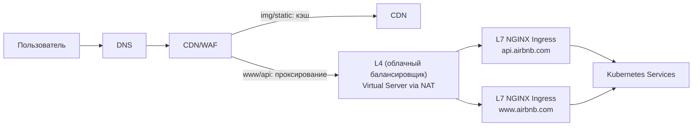
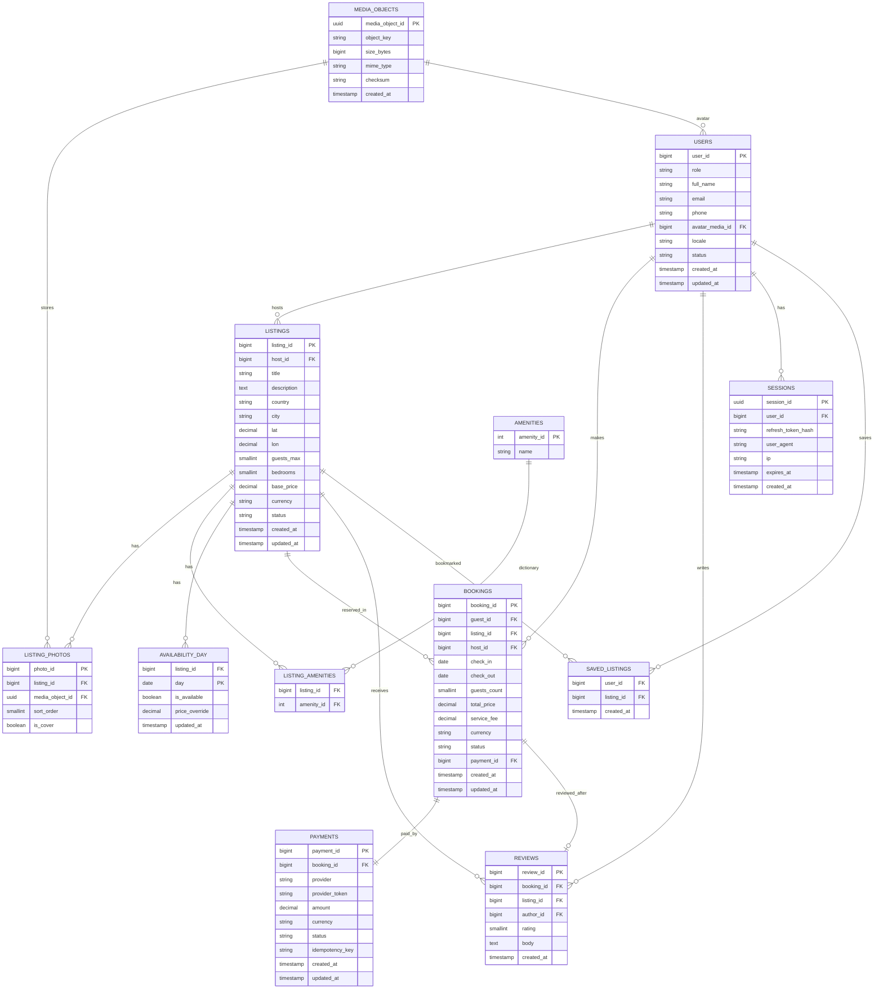
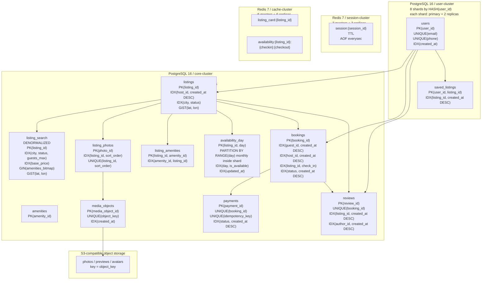

# 1. Сервис краткосрочной аренды жилья (Airbnb)

Airbnb — международная онлайн-платформа для размещения и поиска краткосрочной аренды жилья. Пользователи могут сдавать своё жильё в аренду или бронировать доступные варианты по всему миру через веб-интерфейс или мобильное приложение. Сервис действует в сотнях стран, предлагает миллионы объектов размещения и связывает гостей с хозяевами по всему миру. [[1](https://ru.wikipedia.org/wiki/Airbnb)]

## 1.1 Аналоги

* Booking.com
* Vrbo
* HomeAway
* Agoda

## 1.2 Целевая аудитория

**Аудитория:** пользователи 18–65 лет, планирующие путешествия, командировки и краткосрочные проживания, а также владельцы жилья, сдающие его в аренду.

**География:** глобальная (220+ стран и регионов). [[2](https://www.demandsage.com/airbnb-statistics)]

**Размер аудитории для моделирования нагрузки:**

* Более **150 млн активных пользователей** во всём мире (оценка на 2025–2026). [[3](https://hotelagio.com/airbnb-statistics)]
* Более **200 млн зарегистрированных пользователей** по оценкам сторонних источников. [[4](https://www.businessofapps.com/data/airbnb-statistics/)]

## 1.3 Функционал для проектирования MVP

1. **Поиск жилья:** поиск по локации, датам, числу гостей и фильтры
2. **Каталог объявлений:** карточки объектов, фото, описание, отзывы
3. **Календарь доступности:** отображение доступных и занятых дат, а также синхронизация изменений
4. **Бронирование:** формирование запроса брони, проверка пересечений с другими пользователями
5. **Онлайн-платёж:** интеграция с платёжным провайдером, обработка состояний транзакций
6. **Личный кабинет:** история бронирований, управление объявлениями для хозяев
7. **Отзывы и рейтинги:** после завершения проживания

# 1.4 Продуктовые метрики

| Метрика                                 | Значение | Комментарий / назначение        |
| --------------------------------------- | -------- | ------------------------------- |
| MAU (Monthly Active Users)              | 150 млн  | Активные пользователи в месяц |
| DAU (Daily Active Users)                | 25 млн   | Оценка как 15–20% от MAU        |
| Количество объявлений                   | 8 млн    | Активные листинги на платформе |
| Количество бронирований в год           | 490 млн  | По данным статистики Airbnb |
| Количество бронирований в день          | 1.34 млн | 490 млн / 365                   |
| Количество поисковых запросов в день    | 200 млн  | В среднем 8 поисков на пользователя |
| Количество новых объявлений в день      | 50 тыс   | Добавление нового жилья         |
| Количество отзывов в день               | 500 тыс  | После завершения проживания     |

---

# 2. Расчёт нагрузки

## 2.1 Продуктовые метрики

### Исходные данные

| MAU (Monthly Active Users), млн | DAU (Daily Active Users), млн |
|---------------------------------|-------------------------------|
| 150                             | 25                            |

### Stickiness Factor (SF)

Stickiness Factor (SF) показывает, какая доля MAU возвращается ежедневно:

$$SF = \frac{DAU}{MAU} = \frac{25}{150} \approx 16.7\%$$

Для платформы путешествий это ожидаемо: пользователи заходят в период планирования поездки, а не каждый день.

### Average User Storage (AUS)

AUS (Average User Storage) — средний объём реляционных данных на одного пользователя. Медиафайлы вынесены в отдельный раздел.

**Среднее число бронирований на пользователя** считается из метрик задания 1:

$$\frac{490 \text{ млн бронирований/год}}{150 \text{ млн MAU}} \approx 3.3 \text{ поездки/год}$$

Оба числа — из задания 1: 490 млн бронирований [[5](https://investors.airbnb.com)], MAU 150 млн [[2](https://www.demandsage.com/airbnb-statistics)].

Горизонт хранения — 3 года — проектное решение: храним историю бронирований за последние 3 года. Итого: 3.3 × 3 ≈ **9 бронирований на пользователя**.

Размер одной записи бронирования:

| Поле                     | Описание                                                                                                                               | Тип               | Байт    |
|--------------------------|----------------------------------------------------------------------------------------------------------------------------------------|-------------------|---------|
| booking_id               | уникальный идентификатор бронирования                                                                                                  | int64             | 8       |
| user_id                  | идентификатор гостя                                                                                                                    | int64             | 8       |
| listing_id               | идентификатор объявления об аренде                                                                                                     | int64             | 8       |
| host_id                  | идентификатор владельца жилья — денормализован в запись, чтобы не делать объединение с таблицей объявлений при выплатах и уведомлениях | int64             | 8       |
| check_in, check_out      | даты заезда и выезда                                                                                                                   | date × 2          | 8       |
| total_price, service_fee | итоговая стоимость и сервисный сбор                                                                                                    | DECIMAL(10,2) × 2 | 16      |
| currency                 | валюта оплаты (ISO 4217, напр. USD)                                                                                                    | char(3)           | 4       |
| guests_count             | количество гостей                                                                                                                      | int8              | 1       |
| status                   | статус брони (ожидание / подтверждено / отменено / завершено)                                                                          | int8 (enum)       | 1       |
| payment_id               | идентификатор транзакции в платёжной системе                                                                                           | int64             | 8       |
| created_at, updated_at   | время создания и последнего изменения записи                                                                                           | timestamp × 2     | 16      |
| special_requests         | пожелания гостя, произвольный текст (в среднем ~80 символов)                                                                           | text              | 80      |
| **Итого (поля)**         |                                                                                                                                        |                   | **166** |

Сырых данных: 166 байт. Индексы по полям `user_id` и `listing_id` (тип B-tree, ~50 байт каждый) добавляют ещё 100 байт. С учётом служебного заголовка строки PostgreSQL (~24 байта [[6](https://www.postgresql.org/docs/current/storage-page-layout.html#STORAGE-TUPLE-LAYOUT)]): 166 + 100 + 24 ≈ **~300 байт**.

Оценки размеров остальных сущностей:

- **Профиль (600 байт)** — имя, email, телефон, ссылка на аватар, настройки уведомлений, язык
- **Сохранённое объявление (50 байт)** — пара (user_id, listing_id) + дата добавления
- **Отзыв (500 байт)** — текст (~300 символов в среднем), числовой рейтинг, дата, идентификаторы гостя и объявления
- **Платёжный токен (200 байт)** — токен карты от платёжного провайдера, тип карты, последние 4 цифры для отображения

| Сущность               | Кол-во записей | Размер записи, байт | Итого, байт        |
|------------------------|----------------|---------------------|--------------------|
| Профиль                | 1              | 600                 | 600                |
| История бронирований   | 9              | 300                 | 2700               |
| Сохранённые объявления | 40             | 50                  | 2000               |
| Написанные отзывы      | 6              | 500                 | 3000               |
| Платёжные токены       | 1              | 200                 | 200                |
| **Итого**              |                |                     | **~8500 ≈ 8.5 Кб** |

### Среднее количество действий пользователя в день (СКД)

Берётся активный пользователь из DAU. Число поисков считается из задания 1: 200 млн/день ÷ 25 млн DAU = 8. Просмотры карточек: в среднем ~1 клик на поисковый запрос — иногда пользователь открывает 2–3 варианта для сравнения, иногда не кликает вовсе (результаты не подошли). При 8 запросах в день итого ~7 просмотров. Бронирования и отзывы — доля от DAU:

- бронирования: 1.34 млн/день ÷ 25 млн DAU ≈ 0.05
- отзывы: 0.5 млн/день ÷ 25 млн DAU ≈ 0.02

| Действие                         | Среднее, шт |
|----------------------------------|-------------|
| Загрузка главной / экрана поиска | 2           |
| Поисковые запросы                | 8           |
| Просмотры карточек объявлений    | 7           |
| Проверки дат доступности         | 7           |
| Обращения к профилю / истории    | 1           |
| Оформление бронирования          | 0.05        |
| Написание отзыва                 | 0.02        |
| **Итого**                        | **~25**     |

## 2.2 Технические метрики

### 2.2.1 Хранилище

**Реляционные данные:**

Для профилей берётся 200 млн зарегистрированных пользователей [[4](https://www.businessofapps.com/data/airbnb-statistics/)], а не только активных (150 млн MAU): аккаунты хранятся независимо от активности. При этом у неактивных пользователей (50 млн) данных значительно меньше — только профиль (~0.6 Кб), без истории бронирований и отзывов. Итоговый расчёт: 150 млн × 8.5 Кб + 50 млн × 0.6 Кб ≈ 1.3 ТБ.

Накопленный объём бронирований оценивается за 10 лет с учётом роста платформы: в 2014–2018 годах обрабатывалось 50–270 млн бронирований в год [[5](https://investors.airbnb.com)], в 2019–2024 — 190–490 млн. Суммарно за 10 лет — около 3 млрд записей.

Накопленный объём отзывов: по данным Airbnb, на платформе размещено более 1 млрд отзывов [[7](https://news.airbnb.com/about-us)]. Берём 1 200 млн как оценку с запасом.

| Сущность                   | Расчёт                                                                                           | Объём       |
|----------------------------|--------------------------------------------------------------------------------------------------|-------------|
| Профили пользователей      | 150 млн × 8.5 Кб + 50 млн × 0.6 Кб [[4](https://www.businessofapps.com/data/airbnb-statistics/)] | ~1.3 ТБ     |
| Объявления об аренде       | 8 млн × 3 Кб [[7](https://news.airbnb.com/about-us)]                                             | ~24 ГБ      |
| Бронирования (накопленные) | 3 млрд × 300 байт [[5](https://investors.airbnb.com)]                                            | ~0.9 ТБ     |
| Отзывы (накопленные)       | 1 200 млн × 500 байт [[7](https://news.airbnb.com/about-us)]                                     | ~600 ГБ     |
| **Итого реляционных**      |                                                                                                  | **~2.8 ТБ** |

**Медиаконтент (хранится в объектном хранилище, раздаётся через CDN):**

| Тип                                                          | Расчёт                                                               | Объём      |
|--------------------------------------------------------------|----------------------------------------------------------------------|------------|
| Фото объявлений (в среднем 15 фото × 500 КБ)                 | 8 млн × 7.5 МБ [[7](https://news.airbnb.com/about-us)]               | ~60 ТБ     |
| Превью для поиска (те же 15 фото, уменьшены до 80 КБ каждое) | 8 млн × 1.2 МБ [[8](https://almanac.httparchive.org)]                | ~9.6 ТБ    |
| Фотографии профилей                                          | 150 млн × 150 КБ [[2](https://www.demandsage.com/airbnb-statistics)] | ~22.5 ТБ   |
| **Итого медиа**                                              |                                                                      | **~92 ТБ** |

**Общий объём хранилища: ~95 ТБ**

### 2.2.2 Сетевой трафик

Основной трафик — загрузка фотографий при просмотре объявлений. Поисковый ответ — список результатов в формате JSON с небольшими превью (~50 КБ). Страница конкретного объявления — несколько полноразмерных фото плюс метаданные, в среднем ~1 МБ.

25 млн DAU × 7 просмотров = 175 млн загрузок страниц в день. Перевод в Гбит/с: 175 ТБ × 1000 ГБ/ТБ × 8 Гбит/ГБ ÷ 86 400 с ≈ 16.2 Гбит/с.

| Тип запроса                            | Суточный объём          | Средняя нагрузка | Пик (×2.5)     |
|----------------------------------------|-------------------------|------------------|----------------|
| Поиск (выдача + превью)                | 200 млн × 50 КБ = 10 ТБ | 0.93 Гбит/с      | 2.3 Гбит/с     |
| Загрузка страниц объявлений            | 175 млн × 1 МБ = 175 ТБ | 16.2 Гбит/с      | 40.5 Гбит/с    |
| Прочие запросы (профиль, бронирование) | 50 млн × 5 КБ = 0.25 ТБ | 0.02 Гбит/с      | 0.06 Гбит/с    |
| **Итого**                              | **~185 ТБ/сут**         | **~17.2 Гбит/с** | **~43 Гбит/с** |

94% пикового трафика приходится на загрузку фото объявлений (40.5 из 43 Гбит/с), что делает раздачу медиа через CDN (Content Delivery Network) обязательным архитектурным решением, а не опциональным.

### 2.2.3 RPS

RPS (Requests Per Second) — количество запросов к серверу в секунду. Пиковая нагрузка принята в 3× от среднесуточной.

При открытии страницы объявления браузер делает два отдельных запроса: один за данными объявления, второй — за календарём доступности. Итого запросов к сервису доступности: 175 млн/день (1:1 к просмотрам страниц).

Авторизация и обращения к профилю: 25 млн DAU × 2 запроса (вход + обновление сессии) = 50 млн/день.

| Действие                 | Запросов/день | RPS (среднее) | RPS (пик ×3) |
|--------------------------|---------------|---------------|--------------|
| Поиск                    | 200 млн       | 2315          | 6945         |
| Страницы объявлений      | 175 млн       | 2025          | 6075         |
| Проверка доступности дат | 175 млн       | 2025          | 6075         |
| Бронирование             | 1.34 млн      | 15.5          | 47           |
| Новые объявления         | 0.05 млн      | 0.6           | 2            |
| Отзывы                   | 0.5 млн       | 5.8           | 17           |
| Авторизация / профиль    | 50 млн        | 578           | 1734         |
| **Итого**                |               | **~6965**     | **~20895**   |

### Итоговая таблица продуктовых метрик

| Метрика                              | Значение |
|--------------------------------------|----------|
| MAU                                  | 150 млн  |
| DAU                                  | 25 млн   |
| Stickiness                           | 16.7%    |
| Средний объём данных на пользователя | 8.5 КБ   |
| Среднее число действий в день        | 25       |
| Бронирований на пользователя         | 9        |

---

# 3. Глобальная балансировка нагрузки

## 3.1 Разделение трафика на группы по характеру нагрузки

Трафик разделяется на группы по типу операции и требованиям к задержке и согласованности данных:

| Группа | Тип нагрузки | Примеры запросов | Как масштабируем / требования |
|:---------------------|:---------------------------------------------------------------|:-------------------------------------------------------------------------------------|:--------------------------------------------------------------------------------------------------------------------------------|
| Чтение, публичные | Поиск, карточки объявлений, чтение отзывов, чтение доступности | поиск (200 млн/день), страницы объявлений (175 млн/день), доступность (175 млн/день) | Масштабируем горизонтально (несколько экземпляров сервиса). Для чтений возможны реплики БД. Допустима итоговая согласованность. |
| Чтение, персональное | Профиль, история, сессия | авторизация/профиль (50 млн/день) | Обрабатывается серверами приложения с доступом к БД. Требования по приватности и целостности данных пользователя. |
| Запись, критичная | Бронирование, платежи, транзакции | бронирование (1.34 млн/день), новые объявления (50 тыс/день), отзывы (500 тыс/день) | Все операции записи выполняются через основную БД для обеспечения согласованности данных. |

## 3.2 Физическое расположение датацентра

Один основной ДЦ в Амстердаме, Западная Европа. Причины:

* близко к крупному рынку Европы, что снижает задержку для значимой доли пользователей;
* проще соблюдение требований регулятора GDPR (General Data Protection Regulation);
* для MVP проще обеспечить транзакционную целостность (бронь/платежи) без меж-ДЦ согласования.

## 3.3 Схема глобальной балансировки до датацентра

Так как в системе используется один датацентр, глобальная балансировка между датацентрами отсутствует: все запросы в итоге попадают в один и тот же ДЦ.

Глобальная схема маршрутизации запросов:

* Пользователь выполняет DNS-запрос доменного имени (`www.airbnb.com`, `api.airbnb.com`, `img.airbnb.com`, `static.airbnb.com`)
* DNS возвращает адрес CDN/WAF (единая точка входа)
* CDN/WAF принимает запрос и дальше маршрутизирует его:
  * статика и изображения (`img.airbnb.com`, `static.airbnb.com`) отдаются с CDN (кэш)
  * запросы сайта (`www.airbnb.com`) и API-запросы (`api.airbnb.com`) проксируются в основной датацентр (ДЦ в Амстердаме)

Таким образом, на глобальном уровне:
* ускоряем доставку статического контента за счёт CDN,
* весь серверный трафик приложения обрабатывается в одном датацентре.


## 3.4 Функциональное разбиение по доменным именам

| Публичная точка входа | Адрес               | Назначение                               | Куда ведёт                             |
|-----------------------|---------------------|------------------------------------------|----------------------------------------|
| Web                   | `www.airbnb.com`    | сайт/SPA/SSR                             | CDN/WAF (проксирование) → основной ДЦ  |
| Public API            | `api.airbnb.com`    | поиск/карточки/доступность/профиль/бронь | CDN/WAF (проксирование) → основной ДЦ  |
| Media                 | `img.airbnb.com`    | фото объявлений/аватары                  | CDN (кэш) → объектное хранилище (в ДЦ) |
| Static                | `static.airbnb.com` | JS/CSS                                   | CDN (кэш)                              |

## 3.5 Обоснование расположения ДЦ

Основной продуктовый риск “далёкого” датацентра — рост задержек на интерактивные операции (поиск, карточка, проверка дат, бронирование). Увеличение задержки на десятки–сотни миллисекунд ухудшает поведение пользователей и конверсию [[9](https://www.thinkwithgoogle.com/_qs/documents/9757/Milliseconds_Make_Millions_report_hQYAbZJ.pdf)].

CDN снимает основную нагрузку по трафику: фото и статика приходят из ближайшей точки присутствия, а в датацентр уходят только API-запросы с небольшим объёмом ответа.

Типичные задержки до Западной Европы:

* Европа: ~20–60 мс
* США (восточное побережье): ~80–140 мс
* Азия: ~150–250+ мс

Вывод: один ДЦ в Западной Европе + CDN для контента даёт хороший баланс скорости и простоты для MVP.

## 3.6 Распределение запросов по типам по датацентру

Так как используется один датацентр, то 100% API-запросов обрабатываются в нём.

Масштабирование достигается за счёт балансировщика нагрузки, нескольких серверов приложения и реплик базы данных для операций чтения.

| Тип запроса              | Запросов/день |          RPS (пик ×3) | Где обрабатывается                                                        |
|--------------------------|--------------:|----------------------:|---------------------------------------------------------------------------|
| Поиск                    |       200 млн |                  6945 | ДЦ (серверы приложения + реплики БД для чтения)                           |
| Страницы объявлений      |       175 млн |                  6075 | ДЦ (серверы приложения + реплики БД для чтения)                           |
| Проверка доступности дат |       175 млн |                  6075 | ДЦ (чтение с реплик; финальная проверка при бронировании — в основной БД) |
| Бронирование             |      1.34 млн |                    47 | ДЦ (запись → основная БД)                                                 |
| Новые объявления         |        50 тыс |                     2 | ДЦ (запись → основная БД)                                                 |
| Отзывы                   |       500 тыс |                    17 | ДЦ (запись → основная БД)                                                 |
| Авторизация / профиль    |        50 млн |                  1734 | ДЦ (серверы приложения + БД)                                              |
| **Итого**                |               | **~20 895 RPS (пик)** | **один ДЦ**                                                               |

---

# 4. Локальная балансировка нагрузки

## 4.1 Схема входящей балансировки

После глобального уровня `DNS → CDN/WAF → ДЦ` входящий трафик попадает на **L4-балансировщик** (управляемый облачным провайдером), который не выполняет SSL termination, а лишь проксирует TCP-соединения на пул L7-балансировщиков.

**L7-балансировщики (NGINX Ingress Controller)** выполняют:
- терминацию TLS;
- маршрутизацию по hostname;
- health-check backend-сервисов;
- балансировку запросов между репликами сервисов.

Распределение запросов между репликами сервисов выполняется по алгоритму **round-robin**, поскольку все сервисы stateless — состояние пользователя хранится в БД и Redis, а не в памяти сервера.



## 4.2 Разбиение трафика на группы по доменам

`img.airbnb.com` и `static.airbnb.com` полностью обслуживаются CDN и через ingress ДЦ **не проходят**.

| Группа | Домен | Балансировщик | Метод | SSL termination |
|--------|-------|---------------|-------|----------------|
| Все домены | все | облачный L4 | L4 IP (Virtual Server via NAT) | нет |
| API | `api.airbnb.com` | NGINX Ingress | L7 HTTP (reverse proxy) | L7 (NGINX) |
| Web | `www.airbnb.com` | NGINX Ingress | L7 HTTP (reverse proxy) | L7 (NGINX) |
| Media | `img.airbnb.com` | CDN | — | CDN |
| Static | `static.airbnb.com` | CDN | — | CDN |

## 4.3 Расчёт количества L7-балансировщиков

### Общие входные параметры

| Параметр | Значение | Источник |
|----------|---------|---------|
| Производительность NGINX на 1 vCPU (HTTPS) | 350 TLS handshakes/с | NGINX SSL Performance Report [[11]] |
| Коэффициент новых TLS-соединений k | 1.0 (консервативная оценка) | проектное решение |
| Схема резервирования | N+1 | — |

Пиковый RPS берётся из раздела 2.2.3.

### Группа `api.airbnb.com`

RPS_peak = **20 895** (суммарно по всем API-запросам из раздела 2.2.3).

$$CPS_{peak} = RPS_{peak} \times k = 20895 \times 1 = 20895 \text{ conn/s}$$

Требуемое количество vCPU для SSL-терминации:

$$vCPU = \left\lceil \frac{CPS_{peak}}{350} \right\rceil = \left\lceil \frac{20895}{350} \right\rceil = \lceil 59.7 \rceil = 60 \text{ vCPU}$$

Количество нод при профиле **8 vCPU**:

$$N_{work} = \left\lceil \frac{60}{8} \right\rceil = 8, \quad N_{total} = 8 + 1 = 9$$

Проверка по полосе пропускания: пиковый API-трафик через ingress ≈ **3.6 Гбит/с** << 9 × 8 Гбит/с = 72 Гбит/с → полоса не является ограничителем.

| Параметр | Значение |
|----------|---------|
| RPS_peak | 20 895 |
| CPS_peak (k=1) | 20 895 |
| Ограничитель | SSL CPS |
| Требуется vCPU | 60 |
| Профиль ноды | 8 vCPU |
| N_work | 8 |
| **N_total (N+1)** | **9** |

### Группа `www.airbnb.com`

Загрузка SPA-оболочки: 25 млн DAU × 2 загрузки = 50 млн/день.

$$RPS_{avg} = \frac{50 \text{ млн}}{86400} = 578, \quad RPS_{peak} = 578 \times 3 = 1734$$

$$CPS_{peak} = 1734 \times 1 = 1734 \text{ conn/s}$$

$$vCPU = \left\lceil \frac{1734}{350} \right\rceil = \lceil 4.95 \rceil = 5 \text{ vCPU}$$

При профиле **4 vCPU**:

$$N_{work} = \left\lceil \frac{5}{4} \right\rceil = 2, \quad N_{total} = 2 + 1 = 3$$

| Параметр | Значение |
|----------|---------|
| RPS_peak | 1 734 |
| CPS_peak (k=1) | 1 734 |
| Ограничитель | SSL CPS |
| Требуется vCPU | 5 |
| Профиль ноды | 4 vCPU |
| N_work | 2 |
| **N_total (N+1)** | **3** |

## 4.4 Итоговая сводная таблица L7

| Группа | Домен | Балансировщик | Метод | SSL termination | N_work | N_total | CPU на ноду | Итого CPU |
|--------|-------|---------------|-------|----------------|--------|---------|-------------|-----------|
| API | `api.airbnb.com` | NGINX Ingress | L7 HTTP (reverse proxy) | L7 (NGINX) | 8 | 9 | 8 vCPU | 72 vCPU |
| Web | `www.airbnb.com` | NGINX Ingress | L7 HTTP (reverse proxy) | L7 (NGINX) | 2 | 3 | 4 vCPU | 12 vCPU |
| **Итого** | | | | | **10** | **12** | | **84 vCPU** |

## 4.5 Межсервисная балансировка (Kubernetes)

Межсервисное взаимодействие реализовано средствами Kubernetes Service Discovery. Распределение трафика между pod-ами выполняется по round-robin через kube-proxy в режиме IPVS.


| Тип взаимодействия | Механизм | Метод балансировки |
|---|---|---|
| Внешний запрос → сервис | NGINX Ingress Controller | L7 HTTP (reverse proxy) |
| Сервис → сервис | Kubernetes Service (ClusterIP) | L4 (kube-proxy IPVS) |
| Разрешение имени сервиса | CoreDNS | DNS |
| Хранение списка pod-ов | EndpointSlice | - |

На каждый межсервисный вызов применяются: таймаут, ретрай только для идемпотентных операций, circuit breaker на стороне клиента.

## 4.6 Отказоустойчивость

| Уровень | Механизм | Поведение при отказе |
|---------|---------|---------------------|
| L4 | управляемый балансировщик облака | HA обеспечивается провайдером |
| L7 API | N+1, 9 нод | при отказе 1 ноды оставшиеся 8 покрывают пиковую нагрузку |
| L7 Web | N+1, 3 ноды | при отказе 1 ноды оставшиеся 2 покрывают нагрузку |
| Kubernetes pods | 2–3 реплики на сервис, размещены на разных узлах | health-check исключает недоступные реплики |

---

# 5. Логическая схема данных

## 5.1 Проверка полноты данных для API

В данном разделе проверяется, что логическая модель данных покрывает весь функционал MVP сервиса. Для каждого продуктового сценария указаны сущности данных, которые используются API для выполнения операции.

| Функционал MVP                                                        | Сущности модели данных                                                    |
| --------------------------------------------------------------------- | -------------------------------------------------------------------------------- |
| **Поиск жилья** (по локации, датам, числу гостей и фильтрам)          | `listings`, `availability_day`, `listing_amenities`, `listing_photos`, `reviews` |
| **Каталог объявлений** (карточка объекта: фото, описание, отзывы)     | `listings`, `listing_photos`, `media_objects`, `reviews`, `users`                |
| **Календарь доступности** (отображение занятых и свободных дат)       | `availability_day`, `bookings`, `listings`                                       |
| **Бронирование жилья** (проверка пересечений и создание брони)        | `users`, `listings`, `availability_day`, `bookings`                              |
| **Онлайн-платёж** (создание и обработка транзакции)                   | `payments`, `bookings`, `users`                                                  |
| **Личный кабинет пользователя** (история поездок)                     | `users`, `bookings`, `payments`, `reviews`, `saved_listings`                     |
| **Личный кабинет хозяина** (управление объявлениями и бронированиями) | `users`, `listings`, `bookings`, `reviews`                                       |
| **Отзывы и рейтинги**                                                 | `reviews`, `bookings`, `listings`, `users`                                       |

Ключевой пользовательский сценарий сервиса — бронирование жилья — использует следующий набор сущностей:

```
users → listings → availability_day → bookings → payments
```

Этот набор данных обеспечивает:

* проверку доступности жилья на выбранные даты;
* создание записи бронирования;
* проведение платежа;
* последующую возможность оставить отзыв.

Таким образом, логическая модель данных покрывает весь функционал MVP сервиса краткосрочной аренды жилья.

## 5.2 Логическая схема сущностей



## 5.3 Описание основных таблиц

В таблице ниже указаны логические сущности, средний размер строки, порядок числа строк, пиковая нагрузка на чтение/запись и требования к консистентности.

| Сущность         | Тип данных               | Размер строки | Число строк | Общий размер | Peak read QPS | Peak write QPS | Источник нагрузки          | Консистентность |
|------------------|--------------------------|---------------|-------------|--------------|---------------|----------------|----------------------------|-----------------|
| users            | транзакционные           | ~600 B        | 200 млн     | ~120 ГБ      | ~1734         | ~10            | профиль, авторизация       | strong          |
| sessions         | кэш сессий               | ~200 B        | 50 млн      | ~10 ГБ       | ~1734         | ~600           | авторизация                | strong          |
| listings         | каталог                  | ~3 КБ         | 8 млн       | ~24 ГБ       | ~13000        | ~5             | поиск, карточка            | eventual read   |
| availability_day | календарь                | ~32 B         | 2.9 млрд    | ~93 ГБ       | ~6075         | ~150           | проверка дат, бронирование | strong          |
| bookings         | транзакции               | ~300 B        | 3 млрд      | ~0.9 ТБ      | ~900          | ~47            | бронирование               | strong          |
| payments         | транзакции               | ~200 B        | 3 млрд      | ~600 ГБ      | ~100          | ~100           | платёж                     | strong          |
| reviews          | пользовательский контент | ~500 B        | 1.2 млрд    | ~600 ГБ      | ~3000         | ~17            | карточка объявления        | eventual        |

### Пояснения к расчётам

* `users`, `bookings`, `reviews` и медиа-величины согласованы с оценками из раздела 2.
* Для `listing_photos` принято в среднем **15 фото на объявление**: `8 млн × 15 = 120 млн`.
* Для `listing_amenities` принято в среднем **20 удобств на объявление**: `8 млн × 20 = 160 млн`.
* Для `availability_day` принят rolling horizon **365 дней**: `8 млн × 365 ≈ 2.9 млрд строк`.
* Для `saved_listings` сохранена логика из твоего расчёта AUS: `150 млн активных пользователей × 40 сохранённых объявлений = 6 млрд строк`.

## 5.4 Файловые данные, кэши и буферы

Кроме основных таблиц, для работы API нужны файловые данные, кэши и буферы.

| Набор данных                     | Назначение                                             | Ключ                                | Средний размер записи | Число записей / объектов |              Общий размер |                                 Peak read QPS |           Peak write QPS | Консистентность                            |
|----------------------------------|--------------------------------------------------------|-------------------------------------|----------------------:|-------------------------:|--------------------------:|----------------------------------------------:|-------------------------:|--------------------------------------------|
| Фото объявлений (object storage) | оригиналы изображений                                  | `media_object_id` / `object_key`    |               ~500 КБ |                 ~120 млн |                    ~60 ТБ | origin read низкий, основная выдача через CDN |                      ~30 | eventual                                   |
| Превью для поиска                | уменьшенные изображения                                | `media_object_id` / `object_key`    |                ~80 КБ |                 ~120 млн |                   ~9.6 ТБ | origin read низкий, основная выдача через CDN |                      ~30 | eventual                                   |
| Аватары пользователей            | изображения профилей                                   | `media_object_id` / `object_key`    |               ~150 КБ |                 ~150 млн |                  ~22.5 ТБ | origin read низкий, основная выдача через CDN |                      ~10 | eventual                                   |
| CDN cache                        | кэш фотографий и статики                               | URL / object key                    |    зависит от объекта |                  hot set | зависит от TTL и hit-rate |               почти весь read-трафик по медиа | запись = прогрев/промахи | eventual                                   |
| `session_cache`                  | быстрый доступ к активной сессии                       | `session_id`                        |                ~200 B |                  ~50 млн |                    ~10 ГБ |                                         ~1734 |                     ~600 | strong                                     |
| `listing_card_cache`             | готовая карточка объявления                            | `listing_id`                        |                 ~4 КБ |           ~1 млн hot set |                     ~4 ГБ |                                         ~6075 | ~200 invalidation/update | eventual                                   |
| `availability_cache`             | быстрый ответ по availability                          | `(listing_id, check_in, check_out)` |                 ~64 B |          ~10 млн hot set |                   ~640 МБ |                                         ~6075 | ~150 invalidation/update | strong на бронирование, eventual на чтение |
| `outbox_events`                  | буфер событий после записи бронирования/платежа/отзыва | `event_id`                          |                ~150 B |         ~10 млн за сутки |                   ~1.5 ГБ |                                          ~100 |                     ~100 | at-least-once delivery                     |

## 5.5 Требования к консистентности

### Strong consistency

Нужна для данных, где ошибка приводит к двойному бронированию или финансовой ошибке:

* `bookings`
* `payments`
* `availability_day` для конкретной пары `(listing_id, day)`
* `sessions`

Ключевое требование: после успешного бронирования пользователь не должен увидеть старую доступность на тех же датах в рамках операции записи.

### Eventual consistency

Допустима там, где небольшая задержка обновления не ломает бизнес-сценарий:

* `listing_photos`
* `reviews`
* `saved_listings`
* `listing_card_cache`
* `CDN cache`
* `outbox_events`

Пример: новый отзыв может появиться в карточке с задержкой в несколько секунд без критического влияния на продукт.

## 5.6 Особенности распределения нагрузки по ключам

| Набор данных         | Ключ нагрузки                       | Особенность                                                                                 |
|----------------------|-------------------------------------|---------------------------------------------------------------------------------------------|
| `users`              | `user_id`                           | распределение близко к равномерному                                                         |
| `sessions`           | `session_id`                        | равномерное, hot key почти отсутствует                                                      |
| `listings`           | `listing_id`, `city`                | перекос по популярным городам и топ-объявлениям                                             |
| `availability_day`   | `(listing_id, day)`                 | сильный hot key на популярных объявлениях и праздничных датах                               |
| `bookings`           | `listing_id`                        | запись неравномерна: самые популярные объявления и топ-локации создают конфликтующие записи |
| `reviews`            | `listing_id`                        | чтение смещено в сторону популярных объявлений                                              |
| `listing_card_cache` | `listing_id`                        | hot keys у популярных карточек                                                              |
| `availability_cache` | `(listing_id, check_in, check_out)` | hot keys у популярных городов, выходных и праздничных периодов                              |
| `CDN cache`          | `object_key`                        | сильный перекос по популярным фотографиям на главных направлениях                           |

### Вывод по hot keys

Для Airbnb основная неравномерность идёт не по `user_id`, а по:

* популярным городам;
* конкретным объявлениям;
* диапазонам дат в сезон и праздники.

Поэтому самые чувствительные ключи в системе — это:

* `listing_id`
* `(listing_id, day)`
* `(city, check_in, check_out, guests, filters)` для поиска
* `object_key` для медиа

Именно эти ключи формируют основную нагрузку на чтение и являются кандидатами на кэширование и отдельный контроль hot spots.

---

# 6. Физическая схема данных

## 6.1 Выбор физических хранилищ

Для MVP используются четыре типа хранилищ:

* **PostgreSQL 16** — основное транзакционное хранилище для пользователей, объявлений, календаря доступности, бронирований, платежей и отзывов;
* **Redis 7** — хранение сессий и быстрых кэшей;
* **S3-совместимое объектное хранилище** — фотографии объявлений, превью и аватары;
* **CDN** — кэш и раздача медиафайлов.

Чтобы не смешивать разные ключи шардирования в одном кластере, физическая схема разбита на два PostgreSQL-кластера:

1. **user-cluster** — данные, которые естественно шардируются по `user_id`;
2. **core-cluster** — данные, которые естественно шардируются по `listing_id`.

Это позволяет:

* локализовать основные пользовательские запросы внутри user-cluster;
* локализовать запросы карточки, доступности и бронирования внутри core-cluster;
* избежать лишних cross-shard операций на самом горячем пути.

## 6.2 Физическая схема хранения



## 6.3 Денормализация

В физической схеме используются несколько денормализованных сущностей и полей.

| Объект               | Денормализация                                                                                                            | Зачем                                                                         |
|----------------------|---------------------------------------------------------------------------------------------------------------------------|-------------------------------------------------------------------------------|
| `bookings`           | `host_id`, `listing_id`, `total_price`, `currency` хранятся в бронировании                                                | не читать `listings` при истории поездок, выплатах и отменах                  |
| `reviews`            | `listing_id`, `author_id` хранятся в отзыве                                                                               | быстро выводить отзывы по объявлению и автору                                 |
| `listing_search`     | хранит `city`, `lat/lon`, `guests_max`, `base_price`, `rating_avg`, `reviews_count`, `amenities_bitmap`, `cover_photo_id` | выполнять поиск без тяжёлых JOIN на `listings + reviews + amenities + photos` |
| `listing_card_cache` | хранит уже собранную карточку объявления                                                                                  | не собирать ответ из нескольких таблиц на каждом запросе                      |

`listing_search` — это физическая search-проекция, которая пересобирается при изменении объявления, фотографий, агрегата отзывов и удобств.

## 6.4 Таблицы и хранилища

### 6.4.1 Реляционные таблицы

| Таблица / объект    | СУБД                      | Размер строки | Число строк | Общий размер | Индексы                                                                                                                                          | Шардирование                                                                                | Репликация / резервирование | Клиент / интеграция                   |
|---------------------|---------------------------|--------------:|------------:|-------------:|--------------------------------------------------------------------------------------------------------------------------------------------------|---------------------------------------------------------------------------------------------|-----------------------------|---------------------------------------|
| `users`             | PostgreSQL / user-cluster |        ~600 B |     200 млн |      ~120 ГБ | `PK(user_id)`, `UNIQUE(email)`, `UNIQUE(phone)`, `IDX(created_at)`                                                                               | `HASH(user_id)`, 8 shards                                                                   | primary + 2 replicas        | `SQLAlchemy 2 + asyncpg`, `PgBouncer` |
| `saved_listings`    | PostgreSQL / user-cluster |         ~50 B |     ~6 млрд |      ~300 ГБ | `PK(user_id, listing_id)`, `IDX(listing_id, created_at DESC)`                                                                                    | `HASH(user_id)`, 8 shards                                                                   | primary + 2 replicas        | `SQLAlchemy 2 + asyncpg`, `PgBouncer` |
| `listings`          | PostgreSQL / core-cluster |         ~3 КБ |       8 млн |       ~24 ГБ | `PK(listing_id)`, `IDX(host_id, created_at DESC)`, `IDX(city, status)`, `GiST(lat, lon)`                                                         | `HASH(listing_id)`, 16 shards                                                               | primary + 2 replicas        | `SQLAlchemy 2 + asyncpg`, `PgBouncer` |
| `listing_search`    | PostgreSQL / core-cluster |        ~256 B |       8 млн |        ~2 ГБ | `PK(listing_id)`, `IDX(city, status, guests_max)`, `IDX(base_price)`, `GIN(amenities_bitmap)`, `GiST(lat, lon)`                                  | `HASH(listing_id)`, 16 shards                                                               | primary + 2 replicas        | `SQLAlchemy 2 + asyncpg`, `PgBouncer` |
| `listing_photos`    | PostgreSQL / core-cluster |        ~200 B |     120 млн |       ~24 ГБ | `PK(photo_id)`, `IDX(listing_id, sort_order)`, `UNIQUE(listing_id, sort_order)`                                                                  | `HASH(listing_id)`, 16 shards                                                               | primary + 2 replicas        | `SQLAlchemy 2 + asyncpg`, `PgBouncer` |
| `amenities`         | PostgreSQL / core-cluster |         ~64 B |        ~100 |         мало | `PK(amenity_id)`                                                                                                                                 | reference table on all shards                                                               | replication to all shards   | `SQLAlchemy 2 + asyncpg`              |
| `listing_amenities` | PostgreSQL / core-cluster |         ~24 B |     160 млн |      ~3.8 ГБ | `PK(listing_id, amenity_id)`, `IDX(amenity_id, listing_id)`                                                                                      | `HASH(listing_id)`, 16 shards                                                               | primary + 2 replicas        | `SQLAlchemy 2 + asyncpg`, `PgBouncer` |
| `availability_day`  | PostgreSQL / core-cluster |         ~32 B |    2.9 млрд |       ~93 ГБ | `PK(listing_id, day)`, `IDX(day, is_available)`, `IDX(updated_at)`                                                                               | `HASH(listing_id)`, 16 shards; внутри шарда `RANGE(day)` по месяцам                         | primary + 2 replicas        | `SQLAlchemy 2 + asyncpg`, `PgBouncer` |
| `bookings`          | PostgreSQL / core-cluster |        ~300 B |      3 млрд |      ~0.9 ТБ | `PK(booking_id)`, `IDX(guest_id, created_at DESC)`, `IDX(host_id, created_at DESC)`, `IDX(listing_id, check_in)`, `IDX(status, created_at DESC)` | `HASH(listing_id)`, 16 shards                                                               | primary + 2 replicas        | `SQLAlchemy 2 + asyncpg`, `PgBouncer` |
| `payments`          | PostgreSQL / core-cluster |        ~200 B |      3 млрд |      ~600 ГБ | `PK(payment_id)`, `UNIQUE(booking_id)`, `UNIQUE(idempotency_key)`, `IDX(status, created_at DESC)`                                                | `HASH(listing_id)` через колокацию с `bookings`, 16 shards                                  | primary + 2 replicas        | `SQLAlchemy 2 + asyncpg`, `PgBouncer` |
| `reviews`           | PostgreSQL / core-cluster |        ~500 B |    1.2 млрд |      ~600 ГБ | `PK(review_id)`, `UNIQUE(booking_id)`, `IDX(listing_id, created_at DESC)`, `IDX(author_id, created_at DESC)`                                     | `HASH(listing_id)`, 16 shards                                                               | primary + 2 replicas        | `SQLAlchemy 2 + asyncpg`, `PgBouncer` |
| `media_objects`     | PostgreSQL / core-cluster |        ~160 B |    ~270 млн |       ~43 ГБ | `PK(media_object_id)`, `UNIQUE(object_key)`, `IDX(created_at)`                                                                                   | `HASH(listing_id)` через связь с фото; для аватаров — отдельная запись по `media_object_id` | primary + 2 replicas        | `SQLAlchemy 2 + asyncpg`, `PgBouncer` |

### 6.4.2 Кэши и файловые данные

| Объект                  | Хранилище                    | Ключ                                             |             Размер |           Объём | Шардирование / резервирование                 | Клиент / интеграция  |
|-------------------------|------------------------------|--------------------------------------------------|-------------------:|----------------:|-----------------------------------------------|----------------------|
| `session_cache`         | Redis / session-cluster      | `session:{session_id}`                           |             ~200 B |          ~10 ГБ | Redis Cluster, 3 masters + 3 replicas         | `redis-py`           |
| `listing_card_cache`    | Redis / cache-cluster        | `listing_card:{listing_id}`                      |              ~4 КБ |   ~4 ГБ hot set | Redis Cluster, 6 masters + 6 replicas         | `redis-py`           |
| `availability_cache`    | Redis / cache-cluster        | `availability:{listing_id}:{checkin}:{checkout}` |              ~64 B | ~640 МБ hot set | Redis Cluster, 6 masters + 6 replicas         | `redis-py`           |
| Фото / превью / аватары | S3-compatible object storage | `object_key`                                     |          80–500 КБ |          ~92 ТБ | replication / erasure coding on storage layer | `boto3` / `aioboto3` |
| CDN cache               | CDN                          | URL / `object_key`                               | зависит от объекта |         hot set | edge replication by CDN                       | HTTP integration     |

## 6.5 Балансировка запросов и мультиплексирование подключений

### PostgreSQL

Для PostgreSQL используется разделение read/write трафика:

* **write-запросы** идут в primary соответствующего шарда;
* **read-запросы** идут в read replicas.

Схема доступа:

* приложение → **HAProxy** → **PgBouncer** → PostgreSQL shard
* `PgBouncer` используется в режиме **transaction pooling**
* `HAProxy` держит отдельные upstream-пулы для `rw` и `ro`

Это решает две задачи:

* балансировка чтений между репликами;
* мультиплексирование большого числа клиентских соединений в меньшее число backend-соединений к PostgreSQL.

### Redis

Для Redis используется cluster mode:

* клиент знает hash slots;
* запрос сразу идёт на нужный master;
* replica используется для failover.

### Object storage

Для object storage используется HTTP SDK с keep-alive и connection pool. Основной пользовательский read-трафик по файлам уходит через CDN, поэтому origin получает только запись новых объектов и cache miss.

## 6.6 Надёжность и резервирование

### PostgreSQL

Для каждого PostgreSQL shard используется:

* **1 основная**
* **2 синхронная или асинхронная реплики** в зависимости от роли данных:

  * для `bookings`, `payments`, `availability_day` — минимум одна синхронная replica;
  * для остальных таблиц — асинхронные read replicas допустимы.

Failover выполняется средствами оркестратора PostgreSQL-кластера.

### Redis

* session-cluster: replica обязательна, так как потеря сессий нежелательна;
* cache-cluster: replica нужна для отказоустойчивости, полная потеря кэша допустима, так как он восстанавливается из PostgreSQL и object storage.

### Object storage

Используется встроенная репликация или erasure coding на стороне хранилища. Потеря одного диска или узла не должна приводить к потере фотографий.

## 6.7 Схема резервного копирования

### PostgreSQL

Для PostgreSQL используется:

* **ежедневный full base backup**
* **непрерывная архивация журнал предзаписи**
* **PITR** для восстановления до точки во времени
* хранение backup в object storage
* retention:

  * полный бекап — 14 дней
  * журнал предзаписи — 14 дней
  * еженедельный long-term backup — 3 месяца

Это покрывает:

* логические ошибки пользователя;
* отказ узла;
* восстановление после повреждения данных.

### Redis

* session-cluster: `AOF everysec` + периодический `RDB snapshot`
* cache-cluster: backup не обязателен, так как данные восстанавливаются пересчётом

### Object storage

* versioning для объектов;
* lifecycle policy:

  * оригиналы фото — long-term;
  * превью могут быть пересозданы, но хранятся вместе с оригиналами;
* периодическая проверка checksum для контроля целостности.

## 6.8 Проверка, что выбранные хранилища выдерживают нагрузку

### user-cluster

Общий размер:

* `users` ~120 ГБ
* `saved_listings` ~300 ГБ

Итого: **~420 ГБ**

При 8 шардах:

* **~52.5 ГБ на shard**

Нагрузка:

* peak read ~1734 QPS по `users`
* умеренная запись

Это небольшой объём и невысокий QPS для PostgreSQL на shard.

### core-cluster

Основной объём:

* `bookings` ~0.9 ТБ
* `payments` ~0.6 ТБ
* `reviews` ~0.6 ТБ
* `availability_day` ~93 ГБ
* прочие таблицы ещё ~100 ГБ

Итого: **~2.3 ТБ**

При 16 шардах:

* **~140–145 ГБ на shard**

Пиковая нагрузка:

* основной read идёт на `listing_search`, `listings`, `availability_day`
* основной write идёт на `bookings`, `payments`, `availability_day`

Даже если принять суммарный listing-centric peak read порядка **15–18k QPS**,
на один shard приходится примерно **950–1100 QPS** до репликации.
При двух read replicas это около **300–550 QPS на replica**, что допустимо.

### Redis

* session-cluster: ~10 ГБ и около 2k read QPS — легко помещается;
* cache-cluster: hot set меньше 10 ГБ, peak read около 10–15k QPS — нормальная нагрузка для Redis Cluster.

### Object storage + CDN

Основной медиа-трафик уходит в CDN. Origin получает только:

* загрузку новых фото;
* редкие чтения при cache miss;
* backup / replication трафик.

Следовательно, object storage выдерживает нагрузку при условии, что пользовательская раздача идёт через CDN.

## 6.9 Вывод

Физическая схема данных строится вокруг двух PostgreSQL-кластеров, Redis-кластеров для сессий и кэшей, а также объектного хранилища для медиа.

Такое разделение позволяет:

* выбрать естественный shard key для разных групп данных;
* изолировать пользовательские и listing-centric нагрузки;
* обеспечить сильную консистентность на критическом пути бронирования;
* вынести горячие чтения в кэш и CDN;
* обеспечить резервирование, PITR и отказоустойчивость на уровне каждого хранилища.


## 6.10 Соответствие API и физических хранилищ

Ниже показано, какие физические хранилища используются в основных API-сценариях. Это связывает логическую модель данных из раздела 5 с физической схемой из раздела 6.

| API / сценарий             | Основные хранилища                                         | Что читается / записывается                                                                                            |
|----------------------------|------------------------------------------------------------|------------------------------------------------------------------------------------------------------------------------|
| **Поиск жилья**            | PostgreSQL `core-cluster`, Redis `availability_cache`, CDN | чтение `listing_search`, `availability_cache`; превью изображений через CDN                                            |
| **Карточка объявления**    | PostgreSQL `core-cluster`, Redis `listing_card_cache`, CDN | чтение `listings`, `listing_photos`, `reviews`; фото через CDN; при cache hit карточка берётся из `listing_card_cache` |
| **Календарь доступности**  | PostgreSQL `core-cluster`, Redis `availability_cache`      | чтение `availability_day`; при изменении календаря запись в `availability_day` и инвалидирование `availability_cache`  |
| **Бронирование**           | PostgreSQL `core-cluster`                                  | транзакционная запись в `bookings`, `payments`, обновление `availability_day`; кэш после записи инвалидируется         |
| **Онлайн-платёж**          | PostgreSQL `core-cluster`, внешний платёжный провайдер     | запись/обновление `payments`, изменение статуса `bookings`                                                             |
| **Личный кабинет гостя**   | PostgreSQL `user-cluster`, PostgreSQL `core-cluster`       | чтение `users`, `saved_listings` из `user-cluster`; чтение `bookings`, `payments`, `reviews` из `core-cluster`         |
| **Личный кабинет хозяина** | PostgreSQL `user-cluster`, PostgreSQL `core-cluster`, CDN  | чтение `users` из `user-cluster`; чтение `listings`, `bookings`, `reviews`; фото через CDN                             |
| **Отзывы и рейтинги**      | PostgreSQL `core-cluster`, Redis `listing_card_cache`      | запись `reviews`; чтение `reviews`; после новой записи инвалидируется `listing_card_cache`                             |
| **Авторизация / сессии**   | PostgreSQL `user-cluster`, Redis `session_cache`           | чтение `users`; создание/обновление/чтение сессии в `session_cache`                                                    |

### Пояснение

* **user-cluster** обслуживает user-centric данные: профиль пользователя и сохранённые объявления;
* **core-cluster** обслуживает listing-centric и booking-centric данные: карточки, доступность, бронирования, платежи, отзывы;
* **Redis** используется для hot path чтений и сессий;
* **CDN + object storage** обслуживают весь медиа-контент.

# Список источников

1. Airbnb — онлайн-платформа для поиска и размещения краткосрочной аренды жилья: [https://ru.wikipedia.org/wiki/Airbnb](https://ru.wikipedia.org/wiki/Airbnb)
2. Airbnb Statistics 2026 — данные по аудитории и листингам: [https://www.demandsage.com/airbnb-statistics](https://www.demandsage.com/airbnb-statistics)
3. Airbnb Statistics — данные по аудитории и географии сервиса: [https://hotelagio.com/airbnb-statistics](https://hotelagio.com/airbnb-statistics)
4. Business of Apps — данные по зарегистрированным пользователям Airbnb: [https://www.businessofapps.com/data/airbnb-statistics/](https://www.businessofapps.com/data/airbnb-statistics/)
5. Airbnb Investor Relations — данные по бронированиям: [https://investors.airbnb.com](https://investors.airbnb.com)
6. PostgreSQL Table Row Layout: [https://www.postgresql.org/docs/current/storage-page-layout.html#STORAGE-TUPLE-LAYOUT](https://www.postgresql.org/docs/current/storage-page-layout.html#STORAGE-TUPLE-LAYOUT)
7. Airbnb Newsroom — данные по листингам и отзывам: [https://news.airbnb.com/about-us](https://news.airbnb.com/about-us)
8. HTTP Archive / Web Almanac 2024: [https://almanac.httparchive.org](https://almanac.httparchive.org)
9. Milliseconds Make Millions — влияние скорости загрузки на конверсию: [https://www.thinkwithgoogle.com/_qs/documents/9757/Milliseconds_Make_Millions_report_hQYAbZJ.pdf](https://www.thinkwithgoogle.com/_qs/documents/9757/Milliseconds_Make_Millions_report_hQYAbZJ.pdf)
10. PostgreSQL Continuous Archiving and PITR: [https://www.postgresql.org/docs/current/continuous-archiving.html](https://www.postgresql.org/docs/current/continuous-archiving.html)
11. NGINX SSL Performance Report: [https://cdn.studio.f5.com/files/k6fem79d/production/2805bffce067ef760a8fa8939d7dd8b443a5e5f6.pdf](https://cdn.studio.f5.com/files/k6fem79d/production/2805bffce067ef760a8fa8939d7dd8b443a5e5f6.pdf)
